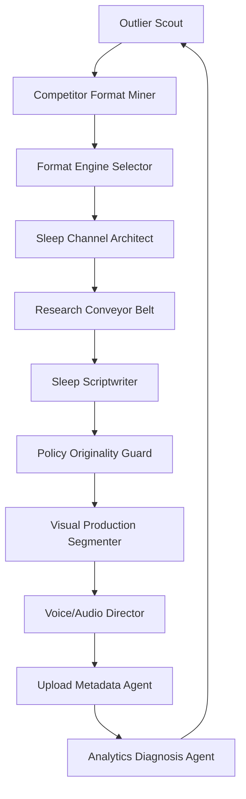

# YT Faceless + Sleep Channel Agent Skill Pack

Version: 1.0  
Built: 2026-07-07  
Primary focus: faceless YouTube, sleep channels, content packaging, copy/scriptwriting, and agentic production systems.  
Primary creator source: Saim / `@saimagnate`, with supporting synthesis from Wanner CashCow, WizofYT public snippets, and YouTube's official monetization policy.

## What this pack is

This is an operational skill pack for agents that build, test, script, produce, and improve faceless YouTube channels, especially sleep/history/story channels. It translates public creator insights into safe, reusable workflows.

The pack is designed to be dropped into a multi-agent system or used manually by a YouTube operator. It emphasizes:

- Saim-style outlier mining and format extraction.
- Sleep-channel architecture that avoids generic AI-template risk.
- Scriptwriting and hook-writing workflows.
- Packaging analysis for titles, thumbnails, and first 30 seconds.
- Policy and originality review before production/upload.
- Analytics loops after upload.
- Clear YAML schemas and reusable prompts.

## What this pack is not

- It is not a promise of RPM, revenue, monetization approval, or growth.
- It is not a license to copy creators' scripts, thumbnails, voices, or proprietary assets.
- It is not a replacement for YouTube policy review, copyright clearance, or editorial judgment.

## Quickstart

1. Read `SOURCE_NOTES_AND_SAIM_NUGGETS.md`.
2. Use `ops/AGENT_TEAM_ORCHESTRATION.md` to assign agents.
3. Start with `skills/01_yt_outlier_scout.md` and fill `schemas/outlier_board_template.csv`.
4. Convert promising outliers using `skills/02_competitor_format_miner.md` and `skills/04_format_engine_selector.md`.
5. Build a channel using `skills/19_sleep_channel_architect.md`.
6. Generate research, script, visuals, and metadata using skills 09–21.
7. Run every video through `skills/20_policy_originality_guard.md` before production and before upload.
8. Use `skills/22_analytics_diagnosis_agent.md` at 48 hours, 7 days, and 28 days.

## Suggested first workflow for a sleep channel



## File map

- `SOURCE_NOTES_AND_SAIM_NUGGETS.md` — condensed source-backed nuggets.
- `ops/AGENT_TEAM_ORCHESTRATION.md` — recommended multi-agent team.
- `ops/90_DAY_OPERATING_PLAN.md` — launch/test plan.
- `skills/` — individual agent skills.
- `schemas/` — reusable YAML/CSV templates.
- `prompts/prompt_bank.md` — large prompt bank for agents.
- `examples/` — example sleep-channel strategy, briefs, and reviews.

## Hard safety rule

Extract patterns, never copy assets. The correct object to copy is the operating structure: viewer behavior, emotional packaging, hook logic, title structure, pacing, and retention devices. The script, visuals, voice, title, and thumbnail must be materially original.


---

# Source Notes and Saim-Heavy Nugget Library

Retrieved: 2026-07-07. This pack was built from public indexed X/Twitter material, ThreadReader mirrors, Rattibha mirrors, creator sites, and YouTube's official monetization policy. X itself did not consistently render in-browser, so the strongest claims in this pack are based on directly readable ThreadReader/Rattibha/official-policy text. Search-snippet-only observations are used only as soft supporting context, not as hard rules.

## Source confidence key

- **High confidence:** directly readable public ThreadReader/Rattibha/official-policy pages.
- **Medium confidence:** indexed search snippets from X or mirrors where the full post was not fully retrievable.
- **Directional only:** creator earnings, RPM, channel-revenue, cost, and sell-multiple claims. These are self-reported by creators and should be treated as hypotheses for testing, not guarantees.

## Core source map

| Label | Source | Use in this pack |
|---|---|---|
| Saim profile corpus | https://threadreaderapp.com/user/saimagnate | Content engines, competitor watching, storytelling format banks, AI voice training, docuseries, explainers, niche-prompt libraries, visual contrast, system thinking. |
| Saim niche research thread | https://threadreaderapp.com/thread/1942873439154372906.html | Fresh outlier research, low-subscriber/high-view signal, loop behavior, sleep stories, comment mining, emotional packaging, reconstructing format not idea. |
| Saim AI conveyor-belt thread | https://threadreaderapp.com/thread/1925457154120577312.html | Research → ghostwrite → fact-check/edit → publish workflow. |
| Saim production/AI stack thread | https://threadreaderapp.com/thread/1912761405784367440.html | Strategic YouTube mining, title/thumbnail/hook analysis, hook construction, research prompts, editing stack. |
| YouTube monetization policy | https://support.google.com/youtube/answer/1311392?hl=en | Originality, repetitive/inauthentic content, reused-content, AI-template, slideshow/text risks. |
| Wanner automation levels thread | https://en.rattibha.com/thread/2061017351370535295 | Sleep channel economics as self-reported, sleep-channel safety steps, automation levels, common mistakes. |
| Wanner public site | https://wannercashcow.com/ | Self-reported revenue/case-study claims and automation course structure. |

---

# Saim-heavy nuggets translated into reusable agent rules

## 1. Do not ask “what niche is unsaturated?” Ask “what viewer behavior is being rewarded?”

Saim repeatedly frames the opportunity around loop behavior rather than abstract niches. Examples he gives or implies include courtroom drama, whisper/sleep stories, streamer beef, comment drama, and other formats where the algorithm repeatedly rewards a viewing behavior. The agent translation is:

> Find the behavior loop first. Then find the content format that serves that behavior cheaply and repeatedly.

Use this in `yt_outlier_scout`, `format_engine_selector`, and `sleep_channel_architect`.

## 2. Outliers are data, not inspiration

Saim’s niche-research method is to search YouTube, filter recent videos, find low-subscriber channels with high views, and dissect the first 30 seconds, title, thumbnail, structure, story, CTA, pacing, and production. The agent translation is:

> A video with unusually high views on a low-subscriber or young channel is a market signal. The agent must extract the format, not admire the idea.

Use this in `yt_outlier_scout`, `competitor_format_miner`, and `packaging_scientist`.

## 3. Copy the format logic, not the creative work

Saim’s phrasing often points toward “format theft,” but the safe and scalable interpretation is pattern extraction: title structure, hook logic, emotional trigger, pacing, visual rhythm, and CTA placement. The agent must never copy scripts, thumbnails, voices, or assets. It should generate materially original episodes from the extracted operating pattern.

Use this in all reverse-engineering skills and in `policy_originality_guard`.

## 4. A niche is emotional packaging

One of Saim’s most useful observations is that a niche is not just the topic; it is the feeling being sold. “History” is broad. “Calm forbidden history for sleep” is a channel. “Courtroom chaos with moral outrage” is a format. “Quiet mysteries from lost civilizations” is a viewer state.

Agent rule:

> Every channel brief must define topic, feeling, promise, tension type, and viewer state.

Use this in `sleep_channel_architect`, `format_engine_selector`, `packaging_scientist`, and `scriptwriter`.

## 5. Comments reveal product-market fit gaps

Saim points to annoyed or underserved comments as a discovery source: viewers complain that creators skipped a topic, failed to explain a detail, missed context, or made the wrong version. Agent rule:

> Mine comments for unmet demand, not just sentiment. Every repeated complaint becomes a topic, hook, or angle candidate.

Use this in `comment_pain_miner` and `analytics_diagnosis_agent`.

## 6. Pick one content engine per channel

On his profile corpus, Saim lists faceless content engines such as invisible force, domino effect, anti-tutorial, false win, and polarization. The agent translation:

- **Invisible force:** reveal the hidden system behind an outcome.
- **Domino effect:** show how one small event cascaded into a big result.
- **Anti-tutorial:** teach through failure, mistakes, or what not to do.
- **False win:** show why a supposed success was actually a trap.
- **Polarization:** frame a contested choice, belief, or rivalry.

Agent rule:

> A channel should have one dominant engine so the audience knows what emotional experience it will get repeatedly.

Use this in `format_engine_selector` and `docuseries_builder`.

## 7. Story formats are inventory

Saim’s profile corpus lists many storytelling formats: origin story, rise/fall, before/after, timeline, cause/effect, chain reaction, turning point, lesson learned, parallel stories, behind-the-scenes, hidden truth, wrong narrative, overlooked variable, real reason, silent factor, unseen system, illusion, misdirection, buried detail, ignored evidence.

Agent rule:

> Do not brainstorm from a blank page. Choose a story format, then fit the topic into it.

Use this in `storytelling_format_selector` and `standard_faceless_scriptwriter`.

## 8. Hook construction: confirm expectation, then create curiosity

Saim’s production thread breaks hook-writing into a structure where the hook should connect to what the title/thumbnail promised, then create a curiosity gap. Agent rule:

> Line 1 must prove the viewer clicked the right video. Line 2 must make them need the next minute.

Use this in `hook_writer`.

## 9. First 30 seconds are the battlefield

Saim’s mining workflow asks the operator to watch the first 30 seconds of top performers and track hook, title formula, length, thumbnail pattern, and structure. Agent rule:

> Every script review must isolate the first 30 seconds and score it independently.

Use this in `packaging_scientist`, `hook_writer`, and `analytics_diagnosis_agent`.

## 10. Model-assisted writing should be staged, not one prompt

Saim’s AI conveyor-belt idea uses different model roles: research, story draft, fact-check/bloat trim, and tone training. Agent rule:

> Split script creation into specialized passes: research, angle, outline, draft, humanization, fact-check, compression, policy review.

Use this in `research_conveyor_belt`, `standard_faceless_scriptwriter`, `sleep_scriptwriter`, and `policy_originality_guard`.

## 11. Train the voice before writing long-form

Saim’s profile corpus includes a long-form faceless AI training concept: define audience, tone, forbidden words, sentence structure, pacing, and example lines before asking for the script. Agent rule:

> Every script generator receives a voice card before the script brief.

Use this in `longform_ai_trainer`.

## 12. Docuseries shape: small event → larger force → hidden mechanism → final revelation

Saim’s docuseries note is especially useful for retention-heavy long-form. Agent rule:

> A docuseries episode should make each section feel like it reveals a deeper layer, not just another fact.

Use this in `docuseries_builder`.

## 13. Explainers convert emotional confusion into mechanism

Saim’s explainer patterns include complexity to clarity, fear to understanding, conflict to mechanism, failure to root cause, tension to timeline, and shock to explanation. Agent rule:

> Start with the viewer’s emotional confusion, then walk them to a mechanism.

Use this in `explainer_builder`.

## 14. Visual fatigue needs planned resets

Saim mentions changing bright/dim visual contrast every 5–10 seconds to reset visual fatigue. For sleep content, this must be adapted: use subtle visual variation rather than energetic cuts. Agent rule:

> Standard faceless: frequent contrast resets. Sleep faceless: slow visual novelty without arousal spikes.

Use this in `visual_contrast_editor` and `visual_production_segmenter`.

## 15. Do the roles manually once before automating

Saim’s “broke guide” logic says operators should trade time for leverage and learn each role before outsourcing or automating. Agent rule:

> Before hiring or fully automating, the operator must complete one cycle manually: idea, research, title, script, edit brief, upload, analytics.

Use this in `production_pm_va_operator`.

---

# Sleep-channel-specific synthesis

Sleep channels are a viewer-state business. The viewer wants low-arousal curiosity, comfort, background continuity, and long-session watch time. The risky version is generic AI narration over a repeated black screen or repeated visuals. The safer version is a branded calm documentary/story property with original scripts, varied subjects, sourced educational context, and recognizable but not templated packaging.

Saim’s sleep-story idea gives the demand clue: people use long videos to relax or sleep. Wanner’s sleep-channel thread adds self-reported economics and safety suggestions: use brand intros, pattern interruptions, different subjects/time zones, educational descriptions, and protection once revenue is significant. YouTube policy adds the hard boundary: repetitive, mass-produced, templated, generic AI content can fail monetization.

Agent rule:

> Sleep content should repeat a calming promise, not repeat the same substance.

---

# Practical example transformations

## Raw topic
Ancient Rome.

## Weak title
Ancient Rome Sleep Story.

## Saim-style format extraction
- Behavior loop: sleep + curiosity.
- Emotional packaging: calm mystery, not academic lecture.
- Content engine: invisible force.
- Story format: hidden truth / buried detail.
- Hook logic: confirm Rome + open a quiet mystery.

## Stronger title options
- Fall Asleep to the Quiet Mysteries of Ancient Rome
- 3 Hours of Calm Roman History They Rarely Teach
- Rainy Night History: The Hidden Rooms, Roads, and Rituals of Rome

## Sleep hook
Tonight, we are going to walk through ancient Rome after the noise has faded, when the markets are closed, the lamps are low, and the city becomes easier to hear. We will follow quiet roads, forgotten rooms, and small details that reveal how the empire actually worked.

## Policy-safe production note
Use original narration, distinct chapters, source-backed context, varied visuals, and educational description. Do not recycle the same black-screen template across dozens of uploads.


---

# Agent Team Orchestration

## Operating thesis

A successful faceless/sleep YouTube operation is not one mega-prompt. It is a conveyor belt of specialized roles. The system should take a market signal, convert it into an original format, write and produce the video, guard against policy risk, and learn from analytics.

## Agent team

```yaml
agent_team:
  market_intelligence_lead:
    skills:
      - yt_outlier_scout
      - competitor_format_miner
      - comment_pain_miner
    cadence: weekly
    output: outlier_board, comment_gap_report

  format_strategist:
    skills:
      - format_engine_selector
      - storytelling_format_selector
      - packaging_scientist
    cadence: per_approved_outlier
    output: format_blueprint

  copy_chief:
    skills:
      - hook_writer
      - standard_faceless_scriptwriter
      - sleep_scriptwriter
      - docuseries_builder
      - explainer_builder
    cadence: per_video
    output: approved_script

  research_editor:
    skills:
      - research_conveyor_belt
      - topic_research_prompt_builder
      - longform_ai_trainer
    cadence: per_video
    output: source_pack, voice_card, script_brief

  production_director:
    skills:
      - visual_production_segmenter
      - visual_contrast_editor
      - voice_audio_director
    cadence: per_video
    output: edit_brief, asset_prompts, audio_spec

  risk_and_policy_editor:
    skills:
      - policy_originality_guard
    cadence: pre_production_and_pre_upload
    output: approve_revise_reject

  publishing_manager:
    skills:
      - upload_metadata_agent
    cadence: per_upload
    output: title, thumbnail_text, description, chapters, pinned_comment

  growth_analyst:
    skills:
      - analytics_diagnosis_agent
      - monetization_expansion_agent
    cadence: 48h_7d_28d_monthly
    output: next_tests, format_updates, monetization_plan

  production_pm:
    skills:
      - production_pm_va_operator
    cadence: continuous
    output: SOPs, hiring_briefs, QA_checklists
```

## Approval flow

```yaml
approval_flow:
  1_market_signal:
    owner: market_intelligence_lead
    must_pass:
      - fresh_outlier_found
      - repeatable_format_detected
      - production_feasible
      - no_direct_copying

  2_format_blueprint:
    owner: format_strategist
    must_pass:
      - viewer_behavior_defined
      - emotional_packaging_defined
      - engine_selected
      - original_angle_defined

  3_script_brief:
    owner: research_editor
    must_pass:
      - factual_material_collected
      - uncertainty_marked
      - tension_bank_present
      - voice_card_present

  4_script:
    owner: copy_chief
    must_pass:
      - first_30_seconds_score_8_plus
      - retention_beats_present
      - title_promise_matched
      - no_generic_ai_tone

  5_policy_review:
    owner: risk_and_policy_editor
    must_pass:
      - materially_original_script
      - varied_substance
      - asset_rights_clear
      - educational_or_narrative_value_clear

  6_production:
    owner: production_director
    must_pass:
      - visual_variation
      - audio_quality
      - sleep_or_standard_pacing_correct
      - no_mismatched_assets

  7_upload:
    owner: publishing_manager
    must_pass:
      - title_thumbnail_hook_alignment
      - accurate_description
      - chapters
      - educational_context_or_sources_when_relevant

  8_iteration:
    owner: growth_analyst
    must_pass:
      - metrics_captured
      - diagnosis_recorded
      - next_test_defined
```

## Cadence

- Daily: one outlier scan, one comment-mining pass, one script or production deliverable.
- Weekly: review 25–50 outliers, approve 3–5 video briefs.
- Monthly: review channel positioning, monetization, and policy risk.
- Quarterly: decide whether to scale, pivot, or kill the channel.


---

# 90-Day Operating Plan

## Goal

Launch and validate one faceless sleep/documentary channel using Saim-style market mining, original scripts, policy-safe production, and tight analytics loops.

## Non-negotiables

- No direct copying of scripts, titles, thumbnails, or assets.
- No generic AI-template factory.
- Every video must have a distinct subject, original narration, and some educational/narrative value.
- Every video must pass policy review before production and before upload.

## Days 1–7: Market and format discovery

Deliverables:

```yaml
market_discovery:
  outliers_collected: 50
  competitor_channels_reviewed: 15
  comment_sections_mined: 30
  format_blueprints: 10
  finalist_channel_concepts: 3
```

Actions:

1. Search YouTube in sleep history, sleep mystery, rainy stories, ancient history sleep, mythology sleep, space sleep, and calm documentaries.
2. Filter for recent videos and low/medium subscriber channels with high views.
3. Watch the first 30 seconds of each outlier.
4. Record title structure, thumbnail promise, hook, voice style, pacing, visual style, length, and comment complaints.
5. Pick one primary channel concept and one backup.

## Days 8–14: Channel architecture

Deliverables:

```yaml
channel_architecture:
  channel_name: selected
  promise: defined
  emotional_packaging: defined
  dominant_engine: selected
  sleep_state: defined
  visual_system: defined
  voice_card: defined
  first_30_topics: drafted
```

Recommended first concept:

```yaml
concept:
  working_name: Sleepy Lost Histories
  promise: Calm long-form stories about strange historical places, lost cities, quiet mysteries, and forgotten inventions.
  emotional_packaging: cozy curiosity
  dominant_engine: invisible_force
  supporting_engines:
    - hidden_truth
    - domino_effect
  length: 90_to_180_minutes
  tone: gentle, specific, source-aware, low-arousal
```

## Days 15–45: 15-video validation batch

Produce and publish 15 videos:

```yaml
validation_batch:
  sleep_history: 5
  sleep_mythology_folklore: 4
  sleep_space_nature: 3
  rainy_original_mystery: 3
```

Metrics to track:

```yaml
metrics:
  impressions: true
  ctr: true
  average_view_duration: true
  average_percentage_viewed: true
  first_30_sec_retention: true
  first_5_min_retention: true
  traffic_sources: true
  returning_viewers: true
  subscribers_gained_per_1000_views: true
  rpm_if_monetized: true
  comments_complaints_requests: true
```

## Days 46–60: Pattern review

Questions:

1. Which topics earned impressions?
2. Which title/thumbnail patterns earned CTR?
3. Which hooks held the first 30 seconds?
4. Which chapters caused exits?
5. Which comment requests repeated?
6. Which production elements were unnecessary?
7. Which videos look too similar and need more variation?

Decisions:

```yaml
decisions:
  double_down_topics: 3_to_5
  kill_topics: 3_to_5
  packaging_rules_to_keep: 5
  script_rules_to_keep: 5
  production_simplifications: 3
```

## Days 61–90: Scale or pivot

Scale only if at least one of these is true:

```yaml
scale_conditions:
  - multiple_videos_have_above_channel_average_ctr
  - multiple_videos_have_strong_first_5_min_retention
  - comments_show_repeat_viewer_intent
  - viewers_request_more_specific_topics
  - production_can_repeat_without_policy_risk
```

If not, pivot the emotional packaging, not necessarily the whole niche. Example: from “sleep history” to “rainy lost-city mysteries” or “quiet myths from forgotten places.”

## End-of-90-day report

```yaml
report:
  winning_viewer_behavior:
  strongest_emotional_packaging:
  best_title_formula:
  best_hook_pattern:
  best_video_length:
  production_cost_per_video:
  policy_risk_trend:
  next_30_topics:
  hire_or_automate_next:
```


---

# Skill 01: YT Outlier Scout

```yaml
id: yt_outlier_scout
category: market_intelligence
inspired_by:
  - Saim niche research thread
  - Saim strategic YouTube mining workflow
```

## Purpose

Find fresh YouTube videos that reveal demand before the market is obvious. The scout identifies low-subscriber/high-view anomalies, records their packaging and format, and ranks them by repeatability, cost, and policy risk.

## Saim-heavy nuggets embedded

- Use outliers as data, not inspiration.
- Look for recent high-view videos on low-subscriber or young channels.
- Study hook, intro, CTA, story, title, thumbnail, pacing, and format.
- Prefer behavior loops over broad niches.

## Inputs

```yaml
niche_seed: string
language: string
target_country: string
content_type: sleep | faceless_documentary | explainer | shorts | other
freshness_window: 7_days | 30_days | 90_days
minimum_views: integer
maximum_subscribers: integer | unknown_allowed
production_budget_per_video: number
risk_tolerance: low | medium | high
```

## Workflow

1. Search YouTube with 10–20 seed phrases related to the viewer behavior, not only the topic.
2. Use recent filters first. Prioritize videos published in the last 7–30 days when possible.
3. Collect videos where views are unusually high relative to subscriber count or channel age.
4. Open each video and record the first 30 seconds: opening line, visual, music, voice, pace, and promise.
5. Extract title formula, thumbnail formula, emotional trigger, video length, and production style.
6. Check whether the format repeats across 3+ videos, either on the same channel or across similar channels.
7. Mine the top comments for unmet demand, confusion, objections, and topic requests.
8. Score opportunity on demand, repeatability, production cost, originality room, and policy risk.
9. Recommend 5–15 original test angles that use the same behavior loop without copying creative assets.

## Output schema

```yaml
outliers:
  - video_title:
    channel_name:
    channel_subscribers:
    views:
    upload_date:
    video_age_days:
    views_to_subscriber_ratio:
    video_length:
    production_style:
    title_formula:
    thumbnail_formula:
    first_30_seconds_summary:
    emotional_trigger:
    behavior_loop:
    repeated_format_evidence:
    comment_gap:
    demand_score_1_10:
    repeatability_score_1_10:
    production_cost_score_1_10:
    originality_room_1_10:
    policy_risk_1_10:
recommended_tests:
  - original_title:
    format_to_test:
    why_it_maps_to_outlier:
    what_must_be_original:
    estimated_cost:
    risk_notes:
```

## Agent prompts

### Outlier scan prompt

```text
You are a YouTube market scout. Find fresh outliers in this niche: {niche_seed}. Prioritize videos from small or medium channels with unusually high views, recent upload dates, and simple repeatable production. For each outlier, extract the behavior loop, emotional trigger, title formula, thumbnail formula, first 30 seconds, and why the algorithm may be rewarding it. Do not recommend copying the video. Recommend original tests that use the same viewer behavior.
```

## Quality gates

- At least 25 outliers for a serious weekly scan.
- At least 5 outliers must be recent, not years-old evergreen giants.
- Every recommended test must name the original value-add.
- Policy risk must be scored before any production recommendation.
- No direct title/script/thumbnail copying.

## Examples

### Sleep outlier interpretation

A 2-hour “rainy medieval castle history” video from a 40K-subscriber channel gets 420K views in 12 days. The scout should not say “copy medieval castles.” It should extract: long sleep session behavior, calm mystery packaging, rain ambience, chaptered history, low-arousal narration, and likely older/US evergreen audience.

## Failure modes

- Chasing old videos with millions of views but no recent evidence.
- Confusing niche demand with one-off viral luck.
- Copying a competitor’s exact topic/title/thumbnail instead of extracting the format.
- Ignoring policy risk because the production is cheap.


---

# Skill 02: Competitor Format Miner

```yaml
id: competitor_format_miner
category: market_intelligence
inspired_by:
  - Saim profile corpus competitor-watching note
  - Saim strategic YouTube mining workflow
```

## Purpose

Turn competitor channels into format intelligence. This skill watches a small set of competitors deeply enough to extract repeatable structures, not surface-level topic ideas.

## Saim-heavy nuggets embedded

- Watch five competitor channels for a focused block and extract ideas from their outliers.
- Open 10–15 top performers and study first 30 seconds.
- Find title, thumbnail, hook, structure, length, pacing, and voice-tone patterns.
- Look for three to four videos that use the same structure and still perform.

## Inputs

```yaml
competitor_channels:
  - url_or_name:
scan_depth: shallow | standard | deep
videos_per_channel: integer
niche_goal: string
content_type: sleep | documentary | explainer | shorts
operator_constraints:
  budget:
  tools:
  team_size:
```

## Workflow

1. For each competitor, identify the top 10 videos by views and top 10 recent videos by relative performance.
2. Group videos by visible format: list, mystery, sleep doc, timeline, rise/fall, hidden truth, reaction, essay, compilation, story reading.
3. Find recurring structures that appear in 3+ successful videos.
4. Record the first 30 seconds of each winning format.
5. Record upload cadence and production complexity.
6. Record comment complaints and repeated audience requests.
7. Create a format map with “copyable logic” and “do-not-copy assets.”
8. Generate original format variants that fit the operator’s budget.

## Output schema

```yaml
competitors:
  - channel:
    positioning:
    recurring_formats:
      - format_name:
        example_videos:
        average_length:
        title_pattern:
        thumbnail_pattern:
        hook_pattern:
        pacing_pattern:
        visual_pattern:
        voice_pattern:
        production_complexity:
        audience_requests:
        weaknesses:
        copyable_logic:
        do_not_copy:
original_format_variants:
  - name:
    viewer_promise:
    title_examples:
    hook_examples:
    production_requirements:
    policy_notes:
```

## Agent prompts

### Competitor format mining prompt

```text
Analyze these competitor channels: {competitor_channels}. Your job is not to copy their topics. Extract the repeatable formats that are working. For each format, describe the viewer promise, emotional trigger, title logic, thumbnail logic, first 30-second hook pattern, pacing, visual system, and production complexity. Then create original variants that preserve the viewer behavior but change the creative substance.
```

## Quality gates

- Each format must be supported by at least 2–3 examples or marked as speculative.
- The output must separate structure from assets.
- Each variant must be feasible under the stated budget.
- Each variant must include a differentiation angle.

## Examples

### Format extraction example

Competitor format: “calm lost city documentaries.” Copyable logic: a place-based mystery, slow opening scene, educational chapters, ambient rain, curiosity title. Do not copy: exact city list, thumbnail composition, voice, script, map sequence, or chapter wording.

## Failure modes

- Only listing video topics.
- Overvaluing subscriber count instead of relative performance.
- Ignoring weak comments that reveal better angles.
- Producing clones that increase reused/inauthentic-content risk.


---

# Skill 03: Comment Pain Miner

```yaml
id: comment_pain_miner
category: market_intelligence
inspired_by:
  - Saim niche research thread comment-gap method
```

## Purpose

Mine YouTube, Reddit, TikTok, and X comments for unmet demand. This converts audience annoyance, confusion, and requests into topics, hooks, and script sections.

## Saim-heavy nuggets embedded

- Start where the audience is annoyed.
- Repeated complaints reveal product-market fit gaps.
- Comments can supply topic angles, missing context, and better hooks.
- Trend plus bad content equals opportunity.

## Inputs

```yaml
sources:
  - platform: youtube | reddit | tiktok | x | other
    url_or_query:
competitor_or_topic: string
min_comments_to_scan: integer
content_type: sleep | faceless_documentary | explainer | other
```

## Workflow

1. Collect comments from outlier videos and adjacent forums.
2. Classify each comment as request, confusion, complaint, praise, skepticism, timestamp drop, or repeat-viewing signal.
3. Cluster repeated phrases and unmet needs.
4. Translate each cluster into a topic angle, title angle, script section, or production fix.
5. Identify language the audience uses naturally and save it in a voice-of-customer bank.
6. Score each gap by frequency, emotional intensity, and ease of solving.
7. Recommend tests that answer the gap more clearly than competitors.

## Output schema

```yaml
comment_clusters:
  - cluster_name:
    frequency:
    representative_paraphrases:
    audience_emotion:
    unmet_need:
    content_opportunity:
    title_angle:
    script_section:
    production_fix:
    priority_1_10:
voice_of_customer_bank:
  - phrase:
    use_case:
recommended_tests:
  - title:
    hook:
    gap_solved:
    differentiation:
```

## Agent prompts

### Comment gap prompt

```text
Analyze these comments as market research. Do not summarize sentiment generally. Extract repeated unmet demand: what viewers wish the creator explained, skipped, slowed down, made longer, made calmer, sourced better, or covered next. Cluster the comments and turn each cluster into a video idea, hook, or script section.
```

## Quality gates

- At least 5 clusters for a deep scan.
- Each cluster must map to a concrete action.
- Use audience language, but do not plagiarize individual comments.
- Mark low-frequency/high-intensity comments separately from high-frequency needs.

## Examples

### Sleep-channel comment gap

Comments say: “voice is too sharp,” “wish this was 3 hours,” “music woke me up,” and “please do Byzantine history.” The miner outputs: soften sibilance, produce longer versions, remove sudden music swells, and add a Byzantine sleep-history video with a calm title.

## Failure modes

- Treating comments as compliments only.
- Overreacting to one loud commenter.
- Ignoring timestamps where viewers report drop-offs or annoyance.
- Using comment language in a way that exposes private or personal details.


---

# Skill 04: Format Engine Selector

```yaml
id: format_engine_selector
category: strategy
inspired_by:
  - Saim profile corpus content-engine list
```

## Purpose

Choose the dominant emotional/narrative engine for a channel or video. A clear engine makes a faceless channel repeatable without making it feel generic.

## Saim-heavy nuggets embedded

- Pick one engine per channel: invisible force, domino effect, anti-tutorial, false win, or polarization.
- A format is stronger than a niche because it predicts audience feeling.
- Use emotional packaging to define what the viewer comes back for.

## Inputs

```yaml
channel_or_video_goal: string
topic_area: string
audience_state: curious | anxious | sleepy | ambitious | angry | nostalgic | confused | other
risk_tolerance: low | medium | high
content_length: shorts | 8_12_min | 15_40_min | 60_180_min
```

## Workflow

1. Define the viewer’s current emotional state and desired emotional payoff.
2. Choose one dominant engine from the engine menu.
3. Map the engine to title logic, hook logic, script structure, and visual tone.
4. Choose 1–2 supporting story formats but do not mix too many engines.
5. Write a one-sentence channel/video promise.
6. Generate 10 topic variants that use the same engine with different substance.
7. Reject engine-topic combinations that create policy, factual, or tone mismatch.

## Output schema

```yaml
selected_engine:
  name:
  why_it_fits:
  viewer_emotion_start:
  viewer_emotion_end:
  title_logic:
  hook_logic:
  script_shape:
  visual_tone:
  sleep_safe_adjustments:
  policy_risks:
  examples:
    - topic:
      title:
      hook:
rejected_engines:
  - name:
    reason:
```

## Agent prompts

### Engine selection prompt

```text
Given this topic and audience state, select the best faceless content engine: invisible force, domino effect, anti-tutorial, false win, or polarization. Explain the viewer emotion, title logic, hook logic, script structure, and why this engine is safer or stronger than alternatives. Then create 10 original topic ideas using that engine.
```

## Quality gates

- One dominant engine only unless there is a strong reason.
- The engine must affect title, hook, and structure, not just the description.
- Sleep videos must avoid high-arousal polarization unless softened heavily.
- Each topic variant must be materially different.

## Examples

### Sleep history engine choice

Topic: lost Roman roads. Best engine: invisible force. Promise: reveal how roads quietly shaped empire, trade, military power, and daily life. Sleep adjustment: make the hidden system calm and atmospheric rather than urgent or conspiratorial.

## Failure modes

- Mixing too many engines in one script.
- Using polarization for sleep content and accidentally raising arousal.
- Picking an engine that creates clickbait the script cannot pay off.
- Treating engine choice as cosmetic.


---

# Skill 05: Storytelling Format Selector

```yaml
id: storytelling_format_selector
category: strategy
inspired_by:
  - Saim profile corpus storytelling-format bank
```

## Purpose

Choose a proven story shape before writing. This prevents blank-page scripts and turns topics into repeatable video structures.

## Saim-heavy nuggets embedded

- Story formats are inventory.
- Use origin, rise/fall, before/after, timeline, cause/effect, chain reaction, turning point, lesson learned, parallel, behind-the-scenes.
- Use hidden/truth formats: hidden truth, wrong narrative, overlooked variable, real reason, silent factor, unseen system, illusion, misdirection, buried detail, ignored evidence.

## Inputs

```yaml
topic: string
content_engine: string
viewer_state: string
video_length: string
content_type: sleep | standard | explainer | docuseries | short
known_facts:
  - fact:
```

## Workflow

1. Identify whether the topic is event-driven, character-driven, system-driven, mystery-driven, or lesson-driven.
2. Choose 3 candidate story formats.
3. For each candidate, outline the first 5 beats.
4. Score each format on curiosity, clarity, retention, originality, and sleep fit if relevant.
5. Select the best format and one backup.
6. Generate section headings and open loops.
7. Pass the selected format to the scriptwriter.

## Output schema

```yaml
candidate_formats:
  - format_name:
    fit_score_1_10:
    curiosity_score_1_10:
    retention_score_1_10:
    originality_score_1_10:
    sleep_fit_1_10:
    beat_outline:
      - beat:
selected_format:
  name:
  reason:
  section_map:
    - section_title:
      open_loop:
      payoff:
backup_format:
  name:
  when_to_use:
```

## Agent prompts

### Format selection prompt

```text
Choose the best story format for this topic: {topic}. Candidate formats include origin, rise/fall, timeline, chain reaction, turning point, hidden truth, wrong narrative, overlooked variable, real reason, unseen system, buried detail, and ignored evidence. Score each candidate and select the format that creates the strongest retention without misleading the viewer.
```

## Quality gates

- Format must be explicit before the script begins.
- Selected format must match the title promise.
- For sleep videos, the format must sustain curiosity without loud tension.
- For educational videos, the format must preserve factual clarity.

## Examples

### Topic transformation

Topic: old maps. Weak approach: list facts about maps. Strong format: “buried detail.” Sections reveal strange map details that show what people feared, misunderstood, or desired. Sleep version uses slow scene-setting and gentle reveals.

## Failure modes

- Choosing “timeline” for every topic.
- Using hidden-truth framing where no hidden truth exists.
- Creating a twist that overstates the evidence.
- Changing story format halfway through the script.


---

# Skill 06: Packaging Scientist

```yaml
id: packaging_scientist
category: copy_packaging
inspired_by:
  - Saim strategic YouTube mining workflow
  - Saim niche research thread
```

## Purpose

Diagnose and create titles, thumbnails, and opening alignment. Packaging earns the click; the first 30 seconds must prove the click was correct.

## Saim-heavy nuggets embedded

- Study title formulas, thumbnail patterns, emotional appeals, hook words, and structure hints.
- First line should connect to title/thumbnail promise.
- Thumbnail tension and title curiosity must point to the same question.
- Packaging beats production early when the format is simple.

## Inputs

```yaml
video_topic: string
viewer_behavior: string
content_engine: string
story_format: string
competitor_outliers:
  - title:
    thumbnail_summary:
    hook_summary:
constraints:
  no_clickbait: true
  sleep_safe: boolean
  max_title_chars: integer
```

## Workflow

1. Define the exact viewer question the package must create.
2. Write 20 titles using different structures: mystery, contradiction, time/place, number, hidden system, soft sleep promise, before/after, consequence.
3. Write 10 thumbnail concepts with one visual subject and one tension idea.
4. Write 10 thumbnail text options under 4 words when text is needed.
5. Pair titles and thumbnails; remove pairs that ask different questions.
6. Write the first 30 seconds for the top 3 packages.
7. Score title-thumbnail-hook alignment.
8. Recommend 3 A/B test candidates.

## Output schema

```yaml
packaging_brief:
  viewer_question:
  title_options:
    - title:
      formula:
      curiosity_gap:
      accuracy_check:
      sleep_safe:
      score_1_10:
  thumbnail_concepts:
    - concept:
      subject:
      tension:
      text:
      visual_contrast:
      score_1_10:
  best_pairs:
    - title:
      thumbnail_concept:
      first_30_seconds:
      alignment_score_1_10:
      risk_notes:
recommended_test:
  primary:
  backup_1:
  backup_2:
```

## Agent prompts

### Packaging generation prompt

```text
Create packaging for this video: {video_topic}. The viewer behavior is {viewer_behavior}. The content engine is {content_engine}. Generate title options, thumbnail concepts, thumbnail text, and first-30-second hooks. Every package must ask one clear question and the opening must immediately prove the title/thumbnail was accurate. Avoid hype the script cannot pay off.
```

## Quality gates

- Title, thumbnail, and hook must ask the same core question.
- No title should require a claim the research cannot support.
- Sleep titles should combine calm benefit with specific curiosity.
- Thumbnail should be legible at small size.
- Top package must include a first-30-second script.

## Examples

### Sleep packaging example

Topic: ancient libraries. Weak: “Ancient Libraries Documentary.” Stronger: “Fall Asleep to the Quiet Mysteries of Ancient Libraries.” Thumbnail: candlelit shelves, old map, tiny text “LOST ROOMS.” First line confirms libraries and opens a calm mystery.

## Failure modes

- Creating a great title but unrelated thumbnail.
- Using “shocking” language in a sleep video.
- Letting AI generate generic titles like “You Won’t Believe…” without a specific mechanism.
- Ignoring first-30-second alignment.


---

# Skill 07: Hook Writer

```yaml
id: hook_writer
category: copy_scriptwriting
inspired_by:
  - Saim hook construction notes
  - Saim strategic YouTube mining workflow
```

## Purpose

Write opening hooks that connect to the click and create a reason to keep watching. Supports standard faceless and sleep modes.

## Saim-heavy nuggets embedded

- Hook should confirm expectation and create curiosity.
- Watch the first 30 seconds of outliers to learn hook patterns.
- Every hook is a pattern, not a script; steal logic, not wording.
- For long-form, hook should set tension and lead into chapter escalation.

## Inputs

```yaml
title: string
thumbnail_summary: string
video_topic: string
content_engine: string
story_format: string
mode: standard | sleep | documentary | shorts
viewer_state: string
tone_card:
  tone:
  forbidden_words:
  sentence_length:
```

## Workflow

1. Identify the promise made by title and thumbnail.
2. Write the confirmation line: prove the viewer clicked the right video.
3. Write the curiosity line: create a question, contradiction, or unresolved image.
4. Write the stakes line: why this matters or why it is worth staying.
5. For standard mode, add tension and pace.
6. For sleep mode, soften stakes into gentle curiosity and permission to relax.
7. Produce 10 hook options and classify each by pattern.
8. Select the best 3 and score them on clarity, curiosity, accuracy, and tone fit.

## Output schema

```yaml
hook_options:
  - hook:
    pattern: contradiction | unfinished_story | hidden_mechanism | soft_mystery | threat | number_mystery | before_after | sensory_scene
    confirms_title: true
    curiosity_gap:
    stakes:
    tone_fit_1_10:
    accuracy_risk_1_10:
selected_hooks:
  primary:
  backup:
  sleep_variant_if_needed:
```

## Agent prompts

### Standard hook prompt

```text
Write 10 hooks for this video. Each hook must be 40–70 words, line 1 must connect directly to the title/thumbnail, and line 2 must open a curiosity gap. Classify each hook by pattern. Avoid fake urgency and claims not supported by the brief.
```

### Sleep hook prompt

```text
Write 10 calm sleep-video hooks. Each should softly confirm the title promise, create gentle curiosity, and give the listener permission to relax. Avoid loud stakes, aggressive CTAs, gore, panic words, and rapid-fire questions.
```

## Quality gates

- Line 1 must match title/thumbnail.
- Hook must make a specific promise, not generic intrigue.
- No unsupported “truth nobody knows” claims.
- Sleep hooks must not wake the listener with hype language.
- Standard hooks must avoid over-explaining before tension is created.

## Examples

### Standard hook pattern

Title: “The Tiny Channel That Beat Everyone With One Format.” Hook: “This channel did not win because the niche was empty. It won because one repeatable format matched a behavior YouTube was already rewarding. Once you see the pattern, you will start noticing it everywhere.”

### Sleep hook pattern

Title: “Fall Asleep to the Quiet Mysteries of Ancient Roads.” Hook: “Tonight, we are going to follow old roads after the day has gone quiet. Some crossed empires, some disappeared under fields, and some still explain how distant cities learned to speak to one another.”

## Failure modes

- Opening with “welcome back” before giving a reason to stay.
- Repeating the title word-for-word without deepening it.
- Adding stakes that the rest of the video never pays off.
- Using too many questions in a sleep hook.


---

# Skill 08: AI Pattern Recognition Prompt Chain

```yaml
id: ai_pattern_recognition_prompt_chain
category: research_packaging
inspired_by:
  - Saim strategic YouTube mining workflow
  - Saim AI conveyor-belt thread
```

## Purpose

Use models as structured analysts for titles, thumbnails, hooks, comments, and scripts. This skill turns messy competitor examples into pattern libraries.

## Saim-heavy nuggets embedded

- Ask AI to analyze title triggers, word patterns, emotional appeals, and structure hints.
- Use separate passes for research, writing, and fact-check/editing.
- Train models on tone before asking them to write.
- Use AI to compress patterns, not to clone outputs.

## Inputs

```yaml
examples:
  titles:
    - string
  thumbnail_summaries:
    - string
  hooks:
    - string
  comments:
    - string
analysis_goal: title | thumbnail | hook | full_format | comment_gap | script_tone
channel_voice_card: optional
```

## Workflow

1. Clean the input examples and remove irrelevant metadata.
2. Run a title-pattern analysis pass.
3. Run a thumbnail-tension analysis pass.
4. Run a first-30-second hook analysis pass.
5. Run a comment-gap analysis pass if comments are available.
6. Ask the model to infer the underlying viewer behavior and emotional packaging.
7. Ask for original variants that use the pattern without reusing wording.
8. Run a final “clone risk” pass to flag outputs too close to examples.

## Output schema

```yaml
pattern_report:
  viewer_behavior:
  emotional_packaging:
  title_patterns:
    - pattern:
      examples_paraphrased:
      original_variants:
  thumbnail_tension_patterns:
    - pattern:
      original_variants:
  hook_patterns:
    - pattern:
      original_variants:
  comment_gap_patterns:
    - gap:
      content_response:
  clone_risk_flags:
    - issue:
      fix:
```

## Agent prompts

### Title pattern analyzer

```text
Analyze these YouTube titles. Do not create titles yet. Extract recurring structures, trigger words, curiosity gaps, specificity level, emotional promise, and implied story format. Then describe how to create original titles using the same logic without copying wording.
```

### Thumbnail tension analyzer

```text
Analyze these thumbnail descriptions. Identify the visual subject, contrast, implied conflict, emotional promise, text style, and curiosity gap. Create original thumbnail concepts that use the same tension logic but different visual composition and assets.
```

### Clone-risk checker

```text
Compare these generated titles/hooks/concepts against the examples. Flag anything that is too close in wording, structure, visual idea, or claim. Rewrite flagged items to preserve the viewer behavior while changing the creative substance.
```

## Quality gates

- Pattern report must include original variants.
- Clone-risk pass is mandatory before using generated outputs.
- Do not ask AI to summarize competitor scripts into reusable scripts.
- For factual niches, separate pattern analysis from fact generation.

## Examples

### Pattern chain use case

Input: 30 successful sleep-history titles. Output: patterns like “Fall asleep to [specific place] + [quiet mystery]” or “[duration] of calm stories from [era/place].” The agent then creates original titles about different places, different mysteries, and different research angles.

## Failure modes

- Letting AI average examples into bland generic titles.
- Generating near-duplicates of competitor titles.
- Mixing analysis and writing in one prompt with no QA.
- Forgetting to check factual claims after packaging generation.


---

# Skill 09: Research Conveyor Belt

```yaml
id: research_conveyor_belt
category: research
inspired_by:
  - Saim AI conveyor-belt thread
```

## Purpose

Create a staged research-to-script pipeline. This skill separates idea collection, factual research, story shaping, fact-checking, and bloat removal.

## Saim-heavy nuggets embedded

- Use one pass to pull ideas and facts, another to shape human story, another to fact-check and trim.
- Ask for deeper controversy, drama, hidden stories, and tensions after the basic summary.
- Train the tone before drafting.
- Flag AI-sounding or fake-sounding lines before production.

## Inputs

```yaml
topic: string
content_type: sleep | standard | explainer | docuseries
length_target_minutes: integer
audience: string
voice_card:
  tone:
  pacing:
  forbidden_words:
source_requirements:
  min_sources: integer
  primary_sources_preferred: boolean
```

## Workflow

1. Generate a 5-point basic summary of the topic.
2. Collect timelines, characters, places, terms, and disputed claims.
3. Identify hidden tensions: controversy, contradiction, human stakes, mystery, mechanism, or neglected detail.
4. Create a fact table with confidence levels.
5. Create a “do not claim” list for uncertain or unsupported claims.
6. Create a story spine: hook, setup, escalation, reveal, payoff, transition.
7. Create visual research notes for editor/visual agent.
8. Pass research to the scriptwriter, then review the script for factual and AI-tone issues.

## Output schema

```yaml
research_pack:
  topic:
  five_point_summary:
    - point:
  timeline:
    - date:
      event:
      confidence:
  key_people_places_terms:
    - item:
      relevance:
  tension_bank:
    - tension:
      type:
      viewer_reason_to_care:
  verified_facts:
    - fact:
      source:
      confidence:
  uncertain_or_disputed:
    - claim:
      caution:
  do_not_claim:
    - claim:
      reason:
  story_spine:
    hook:
    setup:
    escalation:
    reveal:
    payoff:
  visual_research_notes:
    - scene:
      possible_visuals:
```

## Agent prompts

### Research pass prompt

```text
Research this topic for a YouTube video: {topic}. First give a 5-point summary. Then identify deeper tensions: controversy, contradictions, hidden stories, human stakes, mechanisms, and overlooked details. Separate verified facts from uncertain claims. Include a “do not claim” section.
```

### Story spine prompt

```text
Using the research pack, build a story spine for a {content_type} video. The story should have a hook, setup, escalation, reveal, payoff, and transitions. For sleep mode, make the tension gentle and avoid sudden emotional spikes.
```

### Fact-check and bloat-trim prompt

```text
Review this script against the research pack. Flag unsupported claims, fake-sounding lines, vague claims, repeated phrases, and sections that do not advance the viewer’s understanding or sleep experience. Rewrite only the problematic lines.
```

## Quality gates

- Every factual script must include a do-not-claim list.
- Every tension must be supportable or clearly framed as uncertainty.
- Research and scriptwriting should be separate passes.
- Sleep research must include sensory details but not invent facts as if true.

## Examples

### Sleep history research use

Topic: ancient libraries. The conveyor belt outputs verified facts about known libraries, disputed claims about destruction, sensory scene notes, and a gentle story spine around how knowledge traveled, survived, and disappeared.

## Failure modes

- Using one web article as the whole research base.
- Letting AI invent historical details for atmosphere.
- Failing to distinguish myth, legend, and verified history.
- Skipping fact-check because the video is “just for sleep.”


---

# Skill 10: Topic Research Prompt Builder

```yaml
id: topic_research_prompt_builder
category: research
inspired_by:
  - Saim prompt libraries for wellness, crypto, sports, philosophy, finance, aviation/luxury
```

## Purpose

Generate niche-specific research prompts that force depth, structure, and source awareness before scripting.

## Saim-heavy nuggets embedded

- Saim’s prompt banks ask for foundations, terminology, history, current state, misconceptions, examples, research consensus, timelines, and applications.
- Different niches need different research shapes.
- Beginner clarity matters; explain terminology and resistance points.

## Inputs

```yaml
niche: history | wellness | finance | crypto | sports | philosophy | aviation | luxury | true_crime | science | custom
topic: string
audience_level: beginner | intermediate | expert
content_type: sleep | standard | explainer | docuseries
source_standard: light | normal | strict
```

## Workflow

1. Identify the niche and required research dimensions.
2. Create a prompt that collects core facts, timeline, terminology, misconceptions, examples, disputes, and visual references.
3. Add niche-specific cautions: health claims, financial advice, crypto risk, true-crime ethics, historical uncertainty.
4. Add a beginner-translation section if the audience is non-expert.
5. Add sleep-mode sensory/context section when relevant.
6. Add output schema so the researcher returns structured material.

## Output schema

```yaml
research_prompt:
  niche:
  topic:
  prompt_text:
  required_sections:
    - section:
  cautions:
    - caution:
  output_schema:
    field:
      description:
```

## Agent prompts

### Build a niche research prompt

```text
Create a research prompt for this niche and topic: {niche}, {topic}. The prompt must force the researcher to collect core facts, timeline, terminology, misconceptions, examples, disputed claims, audience questions, and visual references. Include niche-specific cautions and a structured output schema.
```

## Quality gates

- Prompt must include uncertainty handling.
- Prompt must include source expectations.
- Prompt must include misconceptions or audience resistance.
- Prompt must adapt for sleep vs standard tone.

## Examples

### Finance prompt shape

Ask for theory, empirical data, regulation, market mechanics, risk, implementation examples, misconceptions, and “not financial advice” boundaries.

### Philosophy prompt shape

Ask for historical context, key arguments, thinkers, terminology, logic, primary texts, schools of thought, and modern relevance.

### Sports prompt shape

Ask for athlete/coach dossier, timeline, game breakdown, technique deconstruction, sports economics, stats, and visual moments.

## Failure modes

- Using a generic research prompt for every niche.
- Missing legal/medical/financial caution areas.
- Asking for “interesting facts” without structure.
- Forgetting audience level.


---

# Skill 11: Standard Faceless Scriptwriter

```yaml
id: standard_faceless_scriptwriter
category: copy_scriptwriting
inspired_by:
  - Saim AI conveyor-belt thread
  - Saim storytelling formats
  - Saim long-form AI snippets
```

## Purpose

Write retention-oriented faceless scripts for standard documentaries, explainers, business breakdowns, essays, and story videos.

## Saim-heavy nuggets embedded

- Build around hook, story, pivot, twist, and outro.
- Use open loops and mini payoffs in long-form.
- Format comes before topic.
- Train tone and forbidden words before drafting.

## Inputs

```yaml
video_brief:
  title:
  thumbnail_summary:
  topic:
  content_engine:
  story_format:
  target_length_minutes:
  audience:
  voice_card:
  research_pack:
  cta_goal:
```

## Workflow

1. Read title and thumbnail; define the exact promise.
2. Read research pack; list factual constraints and do-not-claim items.
3. Write 5 hook options; choose one based on clarity and curiosity.
4. Create a beat outline with open loops and mini payoffs every 60–90 seconds.
5. Write the script in sections: intro tension, setup, escalation, pivot, reveal, payoff, CTA.
6. Add visual directions for each section.
7. Run a bloat pass to remove repetition and generic filler.
8. Run a fact-check pass against the research pack.
9. Run a policy/originality pre-check before handing to production.

## Output schema

```yaml
script_package:
  title:
  thumbnail_summary:
  selected_hook:
  hook_pattern:
  promise:
  beat_outline:
    - timestamp:
      section:
      open_loop:
      payoff:
      visual_direction:
  full_script:
    - timestamp:
      narration:
      visual_direction:
      retention_function:
  cta:
  fact_check_flags:
    - issue:
      fix:
  bloat_removed:
    - line_or_section:
      reason:
```

## Agent prompts

### Faceless script prompt

```text
Write a faceless YouTube script from this brief. The first line must confirm the title/thumbnail promise. The intro must create tension, then the body should move through setup, escalation, pivot, reveal, and payoff. Add mini-payoffs every 60–90 seconds. Include visual directions. Do not invent facts beyond the research pack.
```

### Retention pass prompt

```text
Review this script for retention. Mark every open loop, payoff, slow section, repeated idea, and weak transition. Add a retention beat every 60–90 seconds without adding fake drama.
```

## Quality gates

- First 30 seconds must score at least 8/10 for clarity and curiosity.
- Every major claim must trace to research or be removed.
- No section should exist without a retention function.
- CTA must not interrupt the payoff.

## Examples

### Standard structure

Title: “Why This Tiny Channel Beat Everyone.” Beat map: hook explains it was not niche luck; setup shows competitor landscape; escalation reveals format loop; pivot shows why others copied wrong thing; payoff gives operating system.

## Failure modes

- Overwriting with generic motivational filler.
- Using cliffhangers that never resolve.
- Starting with broad context before the hook.
- Adding unsupported twists.


---

# Skill 12: Sleep Scriptwriter

```yaml
id: sleep_scriptwriter
category: copy_scriptwriting_sleep
inspired_by:
  - Saim sleep-story note
  - Saim hook notes
  - Wanner sleep-channel safety thread
```

## Purpose

Write long-form sleep scripts that combine low-arousal narration with enough curiosity to earn the click and sustain background listening.

## Saim-heavy nuggets embedded

- Sleep channels serve a behavior loop: people want to relax or fall asleep while a story continues.
- Sleep content needs emotional packaging, not just a topic.
- Use soft hooks: curiosity without adrenaline.
- Repeat the calming promise, not the same substance.

## Inputs

```yaml
video_brief:
  title:
  topic:
  sleep_state: rainy | library | fireside | cosmic | cabin | desert_night | custom
  length_minutes: 60 | 90 | 120 | 180 | 240
  chapter_length_minutes: 8_to_12
  audience:
  voice_card:
  research_pack:
  ambience:
  avoid:
    - graphic_violence
    - loud_cta
    - panic_words
    - sudden_music
```

## Workflow

1. Define the soft promise: what the listener will learn or imagine while relaxing.
2. Write a calm opening that confirms the title and gives permission to drift off.
3. Build chapters of 8–12 minutes, each with one gentle question and one soft payoff.
4. Use sensory details: weather, light, texture, distance, footsteps, maps, rooms, sky, water.
5. Keep sentence rhythm medium-long and smooth; avoid punchy hype cadence.
6. Use transitions that make it okay to miss details.
7. For mysteries, avoid graphic or panic language; frame curiosity as quiet exploration.
8. Add a soft CTA only after the listener is settled or at the end.
9. Include visual/audio notes: no sudden brightness, no loud stings, no jarring cuts.

## Output schema

```yaml
sleep_script_package:
  title:
  soft_promise:
  sleep_state:
  opening_hook:
  listener_permission_line:
  chapter_map:
    - chapter_number:
      timestamp_start:
      chapter_title:
      gentle_question:
      sensory_anchor:
      facts_or_story_points:
      soft_payoff:
      transition_line:
  narration:
    - timestamp:
      text:
      voice_direction:
      visual_direction:
      ambience_note:
  soft_cta:
  policy_notes:
  source_notes:
```

## Agent prompts

### Sleep script prompt

```text
Write a long-form sleep script for this topic: {topic}. The tone should be calm, specific, and low-arousal. Open with a soft promise and permission to drift off. Use chapters every 8–12 minutes, each with one gentle question and one soft payoff. Use sensory detail but do not invent factual claims. Avoid loud CTAs, shock language, graphic violence, and sudden tonal shifts.
```

### Sleep rewrite pass

```text
Rewrite this section for sleep. Lower the emotional temperature, smooth the sentence rhythm, remove hype, remove sudden transitions, and keep curiosity gentle. Preserve factual meaning.
```

## Quality gates

- Opening must include soft promise and permission to relax.
- No chapter should spike arousal with sudden danger, gore, yelling, or aggressive CTA.
- Each chapter must have distinct substance, not filler repetition.
- Visual and audio notes must protect sleep continuity.
- Educational descriptions/source notes should be included for factual videos.

## Examples

### Sleep hook example

“Tonight, we are going to wander through the quiet edges of the ancient world, where old roads fade into sand and the names of cities become softer with time. You do not need to remember every date. Let the story move slowly in the background.”

### Chapter loop example

Gentle question: Why did this road vanish while others survived? Soft payoff: because roads needed water, trade, repairs, and political attention; when those faded, stone became memory.

## Failure modes

- Writing a normal documentary and merely adding rain sounds.
- Using crime/horror hooks that are too sharp for sleep.
- Repeating the same ambience, chapter structure, and visuals with no substantive variation.
- Inventing “ancient secrets” without source support.


---

# Skill 13: Docuseries Builder

```yaml
id: docuseries_builder
category: longform_strategy
inspired_by:
  - Saim profile corpus docuseries pattern
```

## Purpose

Build multi-episode or long-form docuseries arcs that feel progressively deeper rather than episodic and flat.

## Saim-heavy nuggets embedded

- Docuseries means unraveling something bigger.
- Pattern: small event → larger force → hidden mechanism → final revelation.
- Each section should reveal a deeper layer.

## Inputs

```yaml
series_topic: string
number_of_episodes: integer
content_engine: invisible_force | domino_effect | false_win | polarization | anti_tutorial
audience: string
mode: standard | sleep
research_pack: optional
```

## Workflow

1. Define the central mystery or mechanism of the series.
2. Find the small opening event that can pull viewers in.
3. Identify the larger force behind the event.
4. Identify the hidden mechanism that most viewers miss.
5. Define the final revelation or reframe.
6. Create episode arcs where each episode answers one question and opens a bigger one.
7. For sleep mode, keep the reveals gentle and atmospheric.

## Output schema

```yaml
docuseries_blueprint:
  series_promise:
  central_question:
  opening_small_event:
  larger_force:
  hidden_mechanism:
  final_revelation:
  episode_map:
    - episode:
      title:
      question_answered:
      bigger_question_opened:
      story_format:
      cliffhanger_or_soft_transition:
      sleep_adjustment:
  continuity_devices:
    - device:
```

## Agent prompts

### Docuseries blueprint prompt

```text
Build a docuseries blueprint using this pattern: small event → larger force → hidden mechanism → final revelation. Each episode must answer a specific question and open a deeper one. For sleep mode, make the tension subtle and use soft transitions instead of cliffhangers.
```

## Quality gates

- Central question must be clear in one sentence.
- Each episode must add a new layer, not repeat the same premise.
- Final revelation must be supported by research.
- Sleep docuseries must avoid urgent cliffhanger language.

## Examples

### Sleep docuseries example

Series: “Roads That Disappeared.” Episode 1 starts with one buried road. Episode 2 reveals trade routes. Episode 3 reveals climate and water. Episode 4 reveals political neglect. Final reframe: roads vanish when the systems around them vanish.

## Failure modes

- Making a playlist rather than a docuseries arc.
- Opening too broad instead of with a small event.
- Using an unsupported final twist.
- Ending every episode with the same vague tease.


---

# Skill 14: Explainer Builder

```yaml
id: explainer_builder
category: copy_scriptwriting
inspired_by:
  - Saim profile corpus explainer patterns
```

## Purpose

Turn confusing, scary, or contested topics into clear mechanism-driven explainers.

## Saim-heavy nuggets embedded

- Explainers convert complexity to clarity, fear to understanding, conflict to mechanism, failure to root cause, tension to timeline, and shock to explanation.
- Start with the viewer’s emotional confusion, then walk them to mechanism.
- Use examples, misconceptions, timelines, and root causes.

## Inputs

```yaml
topic: string
viewer_confusion: string
viewer_level: beginner | intermediate | expert
mode: standard | sleep
length_minutes: integer
research_pack: object
```

## Workflow

1. Define the viewer’s starting confusion or fear.
2. Define the mechanism the viewer should understand by the end.
3. Choose an explainer conversion: complexity→clarity, fear→understanding, conflict→mechanism, failure→root cause, tension→timeline, shock→explanation.
4. Write a simple thesis.
5. Create a section map: problem, misconception, mechanism, example, implication, recap.
6. Add analogies for beginner audiences.
7. For sleep mode, make the explanation slower and sensory, with less urgency.

## Output schema

```yaml
explainer_blueprint:
  viewer_start_state:
  viewer_end_state:
  conversion_type:
  thesis:
  misconceptions:
    - misconception:
      correction:
  mechanism_steps:
    - step:
      simple_explanation:
      example:
  section_map:
    - section:
      purpose:
      visual_direction:
  hook:
  conclusion:
  sleep_adjustments:
```

## Agent prompts

### Explainer prompt

```text
Build an explainer for this topic. Start with the viewer’s confusion, choose one conversion pattern, and move them to a clear mechanism. Include misconceptions, examples, analogies, visuals, and a concise conclusion. Do not overstate evidence.
```

## Quality gates

- The viewer’s before/after state must be explicit.
- Every analogy must clarify, not distort.
- No jargon without explanation.
- Sleep explainers must slow down but still teach.

## Examples

### Explainer example

Topic: Why cities get buried. Conversion: complexity→clarity. Mechanism steps: dust, flooding, abandonment, rebuilding, archaeology, modern excavation. Sleep version: walk slowly through layers of a city at night.

## Failure modes

- Explaining everything chronologically when a mechanism would be clearer.
- Using jargon as a substitute for insight.
- Creating false certainty in disputed topics.
- Making sleep explainers too dense.


---

# Skill 15: Longform AI Trainer

```yaml
id: longform_ai_trainer
category: copy_systems
inspired_by:
  - Saim profile corpus voice-training post
  - Saim long-form faceless AI snippets
```

## Purpose

Create a voice card and writing constraints before generating long-form scripts. This reduces generic AI tone and makes scripts consistent.

## Saim-heavy nuggets embedded

- Train AI on target audience, tone, forbidden words, and sentence structure before writing.
- Long-form should have intro tension, chapter escalation, and mini payoffs.
- Use max sentence-length rules when needed.
- Voice consistency is a system, not a preference.

## Inputs

```yaml
channel_name: string
audience: string
content_type: sleep | documentary | explainer | essay
reference_voice_samples:
  - sample_text
brand_attributes:
  - attribute
forbidden_words:
  - word
sentence_rules:
  max_words_standard: integer
  max_words_sleep: integer
```

## Workflow

1. Create an audience card: who they are, why they click, what they dislike, what they already know.
2. Create a tone card: energy, warmth, authority, humor, pacing, sentence length.
3. Create a forbidden list: clichés, hype words, phrases that sound like AI, banned claims.
4. Create approved phrase patterns: openings, transitions, payoffs, CTAs.
5. Create long-form structure rules: intro tension, chapter escalation, mini payoff, transition, final reframe.
6. Run a sample rewrite test before full script generation.
7. Save the voice card and attach it to every script brief.

## Output schema

```yaml
voice_card:
  audience:
    identity:
    click_reason:
    dislikes:
    knowledge_level:
  tone:
    energy:
    warmth:
    authority:
    pacing:
    humor:
    sentence_length:
  forbidden_words:
    - word_or_phrase:
  approved_patterns:
    openings:
      - pattern:
    transitions:
      - pattern:
    payoffs:
      - pattern:
    ctas:
      - pattern:
  longform_rules:
    intro:
    chapters:
    mini_payoffs:
    transitions:
    conclusion:
  sample_rewrite:
    before:
    after:
```

## Agent prompts

### Voice-card builder

```text
Build a long-form YouTube voice card for this channel. Define the audience, click reason, dislikes, tone, pacing, sentence length, forbidden words, approved phrase patterns, and long-form structure rules. Then rewrite the sample paragraph in the approved voice.
```

### AI-tone scrubber

```text
Review this script for generic AI voice. Flag clichés, vague claims, unnatural transitions, repeated sentence patterns, and over-polished phrases. Rewrite flagged lines using the channel voice card.
```

## Quality gates

- Voice card must exist before script generation.
- Forbidden words and clichés must be concrete.
- One sample rewrite must prove the style.
- Sleep and standard modes need different sentence rhythm rules.

## Examples

### Sleep voice card excerpt

Energy: low. Authority: calm and specific. Pacing: slow, with soft transitions. Forbidden: shocking, unbelievable, insane, smash, terrifying truth. Approved transition: “And from here, the story becomes quieter.”

## Failure modes

- Asking AI to “write in a human tone” with no examples.
- Changing voice every video.
- Using forbidden words in titles/hooks anyway.
- Overfitting to one creator’s voice.


---

# Skill 16: Visual Production Segmenter

```yaml
id: visual_production_segmenter
category: production
inspired_by:
  - Wiz/Julian ecosystem AI segmentation concept
  - Saim production stack references
```

## Purpose

Turn approved scripts into visual production plans for editors or AI-asset agents.

## Saim-heavy nuggets embedded

- Segment scripts into visual beats instead of generating one vague asset list.
- Maintain character/location/style consistency while preserving variation.
- Use human QA for AI visuals.
- Production simplicity is acceptable if the viewer promise is strong and originality is clear.

## Inputs

```yaml
script_package: object
visual_style: string
mode: standard | sleep
asset_sources_allowed:
  - ai_generated
  - licensed_stock
  - public_domain
  - original_graphics
visuals_per_minute: integer
budget: number
```

## Workflow

1. Split the script into visual beats of 5–20 seconds for standard videos or 15–60 seconds for sleep videos.
2. Assign visual type: AI image, slow pan, stock footage, map, archival image, text card, diagram, black screen, ambient loop.
3. Create prompts or asset briefs for each beat.
4. Maintain style guide: aspect ratio, color temperature, camera movement, texture, character consistency, era accuracy.
5. Add variation notes so the video does not look like one repeated template.
6. Add risk notes: copyright, factual mismatch, uncanny faces, violent imagery, medical/financial claims.
7. Produce an editor timeline.

## Output schema

```yaml
visual_plan:
  style_guide:
    aspect_ratio:
    color_temperature:
    motion:
    texture:
    sleep_brightness_rules:
  recurring_elements:
    - element:
  segments:
    - segment_id:
      timestamp_start:
      timestamp_end:
      narration_excerpt:
      visual_type:
      asset_source:
      prompt_or_asset_brief:
      motion_instruction:
      variation_note:
      risk_note:
  qa_checklist:
    - check:
```

## Agent prompts

### Visual segmentation prompt

```text
Segment this script into production beats. For each beat, assign visual type, asset source, prompt or asset brief, motion instruction, variation note, and risk note. In sleep mode, avoid sudden brightness changes, fast cuts, and startling images.
```

## Quality gates

- Every segment must map to narration.
- Asset rights must be known or flagged.
- Sleep visuals must preserve low arousal.
- Repeated visuals must be intentional and varied enough to avoid template risk.

## Examples

### Sleep visual segment

Narration: “The road moved past olive groves and low stone walls.” Visual: slow AI-generated moonlit Roman road, no people, soft rain, 35-second pan, muted brightness, no sudden movement.

## Failure modes

- Using random stock footage that contradicts the script.
- Reusing identical AI prompts across many videos.
- Over-cutting sleep videos.
- Generating historical visuals that look modern without noting it.


---

# Skill 17: Visual Contrast Editor

```yaml
id: visual_contrast_editor
category: production
inspired_by:
  - Saim profile corpus visual contrast note
```

## Purpose

Plan visual variation to reduce fatigue in standard videos and preserve gentle novelty in sleep videos.

## Saim-heavy nuggets embedded

- Saim points to visual contrast changes every 5–10 seconds as a way to reset visual fatigue.
- For sleep, adapt the principle: subtle novelty instead of energetic contrast.
- Visual rhythm should match viewer state.

## Inputs

```yaml
visual_plan: object
mode: standard | sleep
video_length_minutes: integer
current_cut_density: string
viewer_state: string
```

## Workflow

1. Classify the video mode: standard retention or sleep continuity.
2. For standard mode, mark visual reset opportunities every 5–10 seconds: brightness, scale, shot type, graphic, zoom, text, archival cut.
3. For sleep mode, mark soft variation every 20–60 seconds: slow pan, scene dissolve, slight location shift, ambience continuity, chapter card.
4. Identify visual monotony risk and over-stimulation risk.
5. Create an edit rhythm map.
6. Add QA notes for brightness, motion speed, text density, and audio sync.

## Output schema

```yaml
edit_rhythm_map:
  mode:
  reset_interval_guideline:
  monotony_risks:
    - risk:
      fix:
  overstimulation_risks:
    - risk:
      fix:
  timeline_notes:
    - timestamp:
      current_visual:
      recommended_reset:
      reason:
  sleep_specific_rules:
    max_brightness_jump:
    max_motion_speed:
    transition_style:
```

## Agent prompts

### Visual rhythm prompt

```text
Review this visual plan for fatigue and pacing. In standard mode, recommend visual resets every 5–10 seconds where useful. In sleep mode, recommend gentle visual novelty every 20–60 seconds without sudden brightness, fast cuts, or startling images.
```

## Quality gates

- Standard videos must avoid static slides for too long unless intentional.
- Sleep videos must avoid harsh contrast jumps.
- Visual rhythm must support the script’s retention function.
- Every reset must have a purpose.

## Examples

### Adapted sleep contrast

Instead of bright/dim cuts every 5 seconds, a sleep video uses slow dissolves between candlelit library shelves, rain on a window, and a dim map table. Novelty stays gentle.

## Failure modes

- Applying high-energy editing rules to sleep content.
- Adding visual changes that distract from narration.
- Keeping one static AI image for hours with no variation.
- Ignoring brightness spikes.


---

# Skill 18: Voice and Audio Director

```yaml
id: voice_audio_director
category: production_audio
inspired_by:
  - Saim production-stack mentions
  - Saim sleep-story model
```

## Purpose

Specify narration, pacing, cleanup, ambience, and mix rules for faceless videos, especially sleep channels.

## Saim-heavy nuggets embedded

- Voice tone, cadence, and pauses matter as much as the script.
- Sleep-story models often use AI voice, rain, and long-form ambience, but must avoid generic repetition.
- Free/low-cost tools can work early if the audio is clean.

## Inputs

```yaml
script_package: object
mode: standard | sleep
voice_type: human | ai | hybrid
ambience: none | rain | fireplace | room_tone | cosmic | forest | custom
platform_loudness_target: string
voice_card: object
```

## Workflow

1. Define narrator persona: age impression, warmth, authority, distance from mic, energy.
2. Define cadence: words per minute, pause length, emphasis, breathiness, sibilance tolerance.
3. Define ambience: loop length, volume under voice, no sudden changes, licensing status.
4. Define cleanup: noise reduction, de-essing, compression, EQ, mouth noise removal.
5. For sleep, lower energy, soften consonants, avoid dramatic rises, keep ambience stable.
6. For standard, allow more dynamic emphasis but avoid harsh loudness shifts.
7. Create a QA checklist for final audio.

## Output schema

```yaml
audio_spec:
  narrator_persona:
    tone:
    energy:
    warmth:
    authority:
  cadence:
    words_per_minute:
    pause_rules:
    emphasis_rules:
  ambience:
    type:
    source_license:
    volume_relative_to_voice:
    loop_rules:
  processing:
    noise_reduction:
    de_essing:
    compression:
    eq:
    normalization:
  sleep_safety:
    no_sudden_sfx:
    no_loud_cta:
    no_music_swells:
  qa_checklist:
    - check:
```

## Agent prompts

### Audio direction prompt

```text
Create an audio spec for this video. Define narrator persona, cadence, ambience, mix rules, cleanup, and QA. In sleep mode, prioritize low arousal, stable volume, soft consonants, slow pauses, and no sudden effects.
```

## Quality gates

- Audio must be intelligible on phones and gentle on headphones.
- Sleep audio must have no sudden stings or volume jumps.
- Ambience must be licensed or original.
- Voice must match channel voice card.

## Examples

### Sleep audio spec excerpt

WPM: 105–125. Pauses: 0.7–1.5 seconds at section turns. Ambience: rain at -24 to -30 LUFS relative feel, no thunder cracks. CTA: whispered/soft, after early settling period or at end.

## Failure modes

- Using a dramatic trailer voice for sleep content.
- Letting AI voice mispronounce names without QA.
- Using unlicensed ambience loops.
- Adding sudden music cues to create “retention.”


---

# Skill 19: Sleep Channel Architect

```yaml
id: sleep_channel_architect
category: channel_strategy_sleep
inspired_by:
  - Saim sleep-story note
  - Saim emotional packaging idea
  - Wanner sleep-channel safety thread
  - YouTube monetization policy
```

## Purpose

Design sleep channels that can scale while preserving originality, variety, and monetization safety.

## Saim-heavy nuggets embedded

- Sleep is a viewer state, not just a niche.
- People sleep to whisper/long-form stories; serve that behavior loop.
- Use emotional packaging: calm mystery, cozy history, cosmic wonder, rainy folklore.
- Wanner-style safety suggestions: brand intro, pattern interruptions, varied subjects, educational descriptions/resources.
- YouTube policy: avoid repetitive/mass-produced/template content with little variation.

## Inputs

```yaml
channel_goal: string
sleep_subniche: history | mythology | horror | space | nature | fiction | meditation | custom
target_audience: string
risk_tolerance: low | medium | high
production_budget_per_video: number
voice_type: human | ai | hybrid
visual_budget: low | medium | high
upload_cadence: string
```

## Workflow

1. Define the sleep-state promise: what the viewer feels and why they return.
2. Choose the content engine and story formats that fit sleep.
3. Define recurring brand devices: intro line, ambience, narrator persona, chapter style, visual motif.
4. Design variation rules: different eras, places, subjects, chapter structures, visual motifs, source types.
5. Create a 30-video map with distinct subjects and research angles.
6. Define policy-safety rules: original scripts, educational context, varied substance, asset rights, no mass template repetition.
7. Define production specs: length, voice, ambience, visuals, chapters, CTA placement.
8. Define monetization path and risk review cadence.

## Output schema

```yaml
channel_blueprint:
  name:
  promise:
  viewer_state:
  emotional_packaging:
  dominant_engine:
  supporting_story_formats:
  narrator_persona:
  ambience_system:
  visual_system:
  recurring_brand_devices:
    - device:
  variation_rules:
    - rule:
  video_length_range:
  chapter_length_range:
  upload_cadence:
  monetization_paths:
  policy_safety_rules:
    - rule:
30_video_map:
  - title:
    category:
    unique_research_angle:
    soft_hook:
    visual_variation:
    source_or_originality_note:
    policy_risk:
```

## Agent prompts

### Sleep channel blueprint prompt

```text
Design a sleep-channel blueprint for this subniche: {sleep_subniche}. Define the viewer state, emotional packaging, channel promise, dominant engine, narrator persona, ambience, visual system, recurring brand devices, variation rules, and a 30-video topic map. Make it scalable without looking mass-produced or repetitive.
```

## Quality gates

- Blueprint must define both repetition and variation.
- Every topic in the 30-video map must have a unique research or story angle.
- Policy-safety rules must be explicit.
- Sleep promise must be clear in one sentence.

## Examples

### Recommended first channel

Working name: Sleepy Lost Histories. Promise: calm long-form stories about lost places, forgotten inventions, quiet mysteries, old maps, and vanished roads. Dominant engine: invisible force. Sleep state: rainy library. Variation rules: rotate eras, places, object types, and chapter structures.

## Failure modes

- Building a black-screen generic AI-story factory.
- Using the same title formula, same visuals, and same story shape for every upload.
- Ignoring educational/source context in factual sleep videos.
- Choosing horror hooks that make the channel less sleep-friendly.


---

# Skill 20: Policy Originality Guard

```yaml
id: policy_originality_guard
category: risk_policy
inspired_by:
  - YouTube monetization policy
  - Saim safe format-extraction interpretation
  - Wanner sleep-channel safety thread
```

## Purpose

Review videos, channels, scripts, visuals, and metadata for originality, repetition, reused-content, asset, and AI-template risk before production and upload.

## Saim-heavy nuggets embedded

- Extract format logic, not assets or wording.
- Sleep/faceless automation must avoid mass-produced, repetitive, templated content.
- Similar formats can be acceptable only when the substance of each video is materially different.
- Generic AI templates without original insight are high risk.

## Inputs

```yaml
video_package:
  title:
  script:
  visual_plan:
  audio_plan:
  description:
  sources:
  previous_10_uploads:
  asset_licenses:
channel_context:
  niche:
  format:
  upload_cadence:
  monetization_status:
```

## Workflow

1. Check script originality: original narration, commentary, story value, educational value, and source use.
2. Compare against previous 10 uploads for repeated template, repeated substance, repeated visuals, and repeated title formula.
3. Check reused-content risk: third-party clips, readings, compilations, public-domain material, transformations, commentary.
4. Check AI-template risk: generic script, repeated prompts, little variation, no original insight.
5. Check asset rights: music, ambience, stock footage, AI-image terms, archival images, voices.
6. Check metadata accuracy: title, thumbnail, description, chapters, claims.
7. Score risks and issue approve, revise, or reject.
8. List required fixes before publication.

## Output schema

```yaml
policy_review:
  overall_risk: low | medium | high
  decision: approve | revise | reject
  script_originality:
    score_1_10:
    issues:
      - issue:
        fix:
  repetitive_template_risk:
    score_1_10:
    comparison_to_previous_uploads:
      - similarity:
        fix:
  reused_content_risk:
    score_1_10:
    assets_or_segments:
      - asset:
        risk:
        license_or_transformation:
        fix:
  ai_genericity_risk:
    score_1_10:
    issues:
      - issue:
        fix:
  metadata_accuracy:
    score_1_10:
    issues:
      - issue:
        fix:
  required_fixes:
    - priority:
      fix:
  final_notes:
```

## Agent prompts

### Policy review prompt

```text
Review this video package for YouTube originality, repetitive-template, reused-content, AI-genericity, metadata, and asset-rights risk. Compare it to the previous 10 uploads. Decide approve, revise, or reject. If revise or reject, list required fixes. Be stricter with generic AI narration, repeated visuals, repeated templates, readings of material not created by us, and low educational/narrative value.
```

## Quality gates

- Reject if the video is generic AI narration over repetitive visuals with minimal original substance.
- Revise if title promises a claim the script cannot support.
- Revise if factual sleep video has no educational context or source notes.
- Reject if asset rights are unknown for core visuals/audio.
- Approve only when the video is materially original and varied.

## Examples

### High-risk example

100 uploads with the same black screen, same rain loop, same AI voice, same generic story prompt, and titles like “Sleep Story #47.” Decision: reject or heavily revise.

### Lower-risk example

A calm history video with original research, distinct chapters, varied visuals, source notes in the description, licensed ambience, and a unique topic compared with prior uploads. Decision: likely approve after checks.

## Failure modes

- Treating monetization risk as only copyright risk.
- Ignoring similarity across the channel.
- Approving AI scripts because they “sound fine” despite generic substance.
- Assuming public-domain material can be monetized without transformation or context.


---

# Skill 21: Upload Metadata Agent

```yaml
id: upload_metadata_agent
category: publishing
inspired_by:
  - Saim packaging workflow
  - Wanner educational-description safety suggestion
  - YouTube monetization policy
```

## Purpose

Create accurate, aligned upload metadata that improves click-through while supporting viewer trust and policy safety.

## Saim-heavy nuggets embedded

- Title, thumbnail, and hook must align.
- For sleep/factual channels, educational descriptions and resources can strengthen authenticity.
- Packaging should not promise what the script does not deliver.

## Inputs

```yaml
video_package:
  title_candidates:
  selected_title:
  thumbnail_concept:
  script_summary:
  chapter_map:
  sources:
  cta_goal:
  channel_voice_card:
mode: standard | sleep
```

## Workflow

1. Validate title accuracy against script.
2. Create description opening that repeats the viewer promise naturally.
3. For factual content, include source/context notes without overloading the viewer.
4. Create chapters based on actual script sections.
5. Create pinned comment that invites useful feedback or next-topic requests.
6. Create tags/keywords only as secondary support.
7. Create a soft CTA for sleep mode or a direct CTA for standard mode.
8. Run metadata through policy/originality guard.

## Output schema

```yaml
metadata_package:
  title:
  thumbnail_text:
  description:
    opening:
    context:
    sources_or_resources:
    cta:
  chapters:
    - timestamp:
      title:
  pinned_comment:
  tags:
    - tag:
  hashtags:
    - hashtag:
  end_screen_plan:
  metadata_accuracy_notes:
```

## Agent prompts

### Metadata prompt

```text
Create upload metadata for this video. Ensure the title, thumbnail, description, chapters, and pinned comment all match the script. For sleep mode, keep the CTA soft and preserve the calming promise. For factual content, include educational context or source notes.
```

## Quality gates

- No metadata claim may exceed the script evidence.
- Chapters must match actual timestamps/sections.
- Sleep descriptions should be calming and clear, not hype-heavy.
- Pinned comment should mine future audience demand.

## Examples

### Sleep description opening

“A calm long-form journey through old roads, quiet cities, and forgotten details from the ancient world. Let the story play softly in the background while you rest, read, or fall asleep.”

## Failure modes

- Keyword-stuffing descriptions.
- Using sensational thumbnail text for a calm video.
- Adding fake sources or vague “research says” claims.
- Using a loud CTA in sleep metadata.


---

# Skill 22: Analytics Diagnosis Agent

```yaml
id: analytics_diagnosis_agent
category: growth_analytics
inspired_by:
  - Saim underperformance snippet
  - Saim outlier/packaging methodology
```

## Purpose

Diagnose video performance and convert metrics into the next test. This skill separates packaging problems from topic, hook, retention, and production problems.

## Saim-heavy nuggets embedded

- When a video underperforms, the symptom points to the layer that needs fixing.
- Outliers should update the format map.
- Comments and retention graphs reveal what to test next.
- Do not change everything at once.

## Inputs

```yaml
video_metrics:
  impressions:
  ctr:
  average_view_duration:
  average_percentage_viewed:
  retention_graph_notes:
  first_30_sec_retention:
  first_5_min_retention:
  traffic_sources:
  subscribers_gained:
  comments:
  rpm_if_available:
video_package:
  title:
  thumbnail:
  hook:
  length:
  topic:
  script_structure:
```

## Workflow

1. Classify the primary problem: impressions, CTR, first-30 retention, mid-video retention, topic satisfaction, production, or monetization.
2. If impressions are low, review topic demand and channel authority.
3. If CTR is low, review title/thumbnail promise and specificity.
4. If first-30 retention is low, review hook alignment and opening pace.
5. If mid-video retention drops, review section pacing, payoff timing, visuals, and audio.
6. If comments complain, cluster them with comment_pain_miner.
7. Recommend one packaging test and one content-structure test at a time.
8. Update the format rules based on evidence.

## Output schema

```yaml
diagnosis:
  primary_issue: impressions | ctr | first_30_sec | mid_retention | topic | production | monetization | unclear
  evidence:
    - metric:
      interpretation:
  likely_causes:
    - cause:
      confidence:
  recommended_tests:
    title_tests:
      - title:
    thumbnail_tests:
      - concept:
    hook_tests:
      - hook_change:
    structure_tests:
      - change:
    topic_tests:
      - topic:
  updated_format_rules:
    - rule:
  do_not_change_yet:
    - element:
```

## Agent prompts

### Analytics diagnosis prompt

```text
Diagnose this video. Separate click problem, hook problem, retention problem, topic problem, and production problem. Use metrics and comments as evidence. Recommend a small number of tests, not a full rebuild. Update the channel’s format rules only where the evidence is strong.
```

## Quality gates

- Diagnosis must cite metric evidence.
- Recommend no more than 3 primary tests at once.
- Do not declare a topic dead from one weak upload.
- For sleep videos, interpret long-tail performance over longer windows too.

## Examples

### Diagnosis examples

High impressions + low CTR = packaging problem. Good CTR + bad first 30 seconds = hook/promise mismatch. Good first 5 minutes + sharp drop at chapter 2 = pacing or chapter transition issue. Good retention + low impressions = topic/search/browse distribution issue.

## Failure modes

- Changing niche, title, thumbnail, hook, voice, and length all at once.
- Ignoring traffic source differences.
- Judging sleep videos too early when they may accrue long-tail sessions.
- Overfitting to a tiny sample.


---

# Skill 23: Monetization Expansion Agent

```yaml
id: monetization_expansion_agent
category: business
inspired_by:
  - WizofYT public snippets on monetizing faceless audiences beyond simple PDFs
  - Wanner automation-level framing
```

## Purpose

Plan monetization beyond basic AdSense while respecting audience fit and channel trust.

## Saim-heavy nuggets embedded

- Faceless audiences can be monetized beyond one product type.
- Channel type determines monetization path: sleep differs from educational, branded, or automation channels.
- Do not damage retention/trust with mismatched offers.

## Inputs

```yaml
channel:
  niche:
  audience:
  monthly_views:
  monetization_status:
  top_videos:
  audience_comments:
  email_or_community_assets:
  brand_safety_level:
risk_tolerance: low | medium | high
```

## Workflow

1. Classify the channel audience: passive sleep, active learner, buyer intent, hobbyist, status/luxury, professional, fan community.
2. Identify monetization paths: AdSense, sponsorships, affiliate, newsletter, community, membership, digital product, licensing, lead generation, merch, app/tool.
3. Score each path on audience fit, trust risk, operational complexity, and revenue potential.
4. For sleep channels, prioritize low-friction monetization: AdSense, ambient/sleep playlists, sponsorships aligned with relaxation, optional memberships.
5. For educational faceless channels, consider newsletters, guides, tools, affiliates, and communities.
6. Design CTA placement that does not hurt viewer state.
7. Create a 90-day monetization test plan.

## Output schema

```yaml
monetization_plan:
  audience_type:
  current_revenue_streams:
  candidate_streams:
    - stream:
      audience_fit_1_10:
      trust_risk_1_10:
      complexity_1_10:
      potential_1_10:
      cta_placement:
      test_plan:
  recommended_sequence:
    - phase:
      stream:
      reason:
  avoid:
    - stream:
      reason:
```

## Agent prompts

### Monetization planner prompt

```text
Create a monetization expansion plan for this faceless channel. Classify the audience, score possible revenue streams, and recommend a sequence that protects trust and retention. For sleep channels, avoid intrusive CTAs and mismatched aggressive offers.
```

## Quality gates

- Offer must match audience state.
- Sleep channels should not interrupt relaxation with hard sells.
- Monetization claims must be conservative and tested.
- Sponsorships must fit brand safety and audience trust.

## Examples

### Sleep monetization fit

Good fit: calm sponsor reads, sleep/relaxation apps if compliant, ambient playlist membership, long compilations, AdSense. Weak fit: aggressive trading affiliate, loud mid-roll script, unrelated hustle product.

## Failure modes

- Assuming all faceless channels can sell the same product.
- Adding CTAs that harm retention.
- Promoting risky financial/health claims without compliance.
- Ignoring brand-safety concerns.


---

# Skill 24: Production PM / VA Operator

```yaml
id: production_pm_va_operator
category: operations
inspired_by:
  - Saim broke-guide/systemization notes
  - Saim YouTube automation as systems
```

## Purpose

Turn the skills into repeatable SOPs for a solo operator, VA team, or agent team. Learn the roles manually once, then automate or delegate.

## Saim-heavy nuggets embedded

- Do every role yourself once before automating or hiring.
- YouTube automation is a system: idea, script, edit, upload, analytics, revenue.
- Trade time for leverage early; buy back time after the process is understood.
- Foundation matters more than trying to master everything in 30 days.

## Inputs

```yaml
operation_stage: solo | first_va | small_team | agent_team | scaling
weekly_video_target: integer
budget_per_video: number
team_members:
  - role:
current_sops:
  - sop:
quality_issues:
  - issue:
```

## Workflow

1. Map the full production chain: outlier research, brief, research, packaging, script, policy, visuals, audio, edit, upload, analytics.
2. Identify which steps the operator has personally completed at least once.
3. Create SOPs for each step with inputs, outputs, quality gates, and owner.
4. Define handoff formats between agents/people.
5. Define QA checklists and escalation rules.
6. Decide what to delegate next based on bottleneck, not preference.
7. Create hiring/test tasks for VAs, researchers, editors, and scriptwriters.
8. Measure production cost, cycle time, revision count, and performance outcome.

## Output schema

```yaml
ops_plan:
  stage:
  production_chain:
    - step:
      owner:
      input:
      output:
      quality_gate:
      sop_link:
  manual_experience_check:
    - step:
      operator_has_done_once: true | false
      action:
  bottlenecks:
    - bottleneck:
      evidence:
      fix:
  delegation_plan:
    - role:
      task:
      test_assignment:
      qa_criteria:
  weekly_cadence:
    monday:
    tuesday:
    wednesday:
    thursday:
    friday:
  metrics:
    - metric:
```

## Agent prompts

### Production system prompt

```text
Build an SOP and delegation plan for this YouTube operation. Map every step from outlier research to analytics. Identify which steps the operator must do manually once before delegating. Recommend what to automate or hire next based on bottlenecks and quality risk.
```

## Quality gates

- Every handoff must have a clear input and output.
- No role should receive a vague task like “make it better.”
- QA owner must be separate from creator where possible.
- Policy review cannot be skipped to hit upload cadence.

## Examples

### First VA task

Ask VA to fill 20 rows of the outlier board with title, channel, views, subs, upload age, length, thumbnail summary, first 30-second summary, and comment gaps. Grade accuracy before giving creative decisions.

## Failure modes

- Hiring before understanding the task.
- Delegating strategy to low-context assistants.
- No QA checklist.
- Optimizing production volume before finding a format that works.


---

# Prompt Bank

Use these prompts with the skills. Replace bracketed variables. Prompts are model-agnostic.

---

## 1. Fresh outlier scan

```text
You are a YouTube outlier scout. Search or analyze the niche [NICHE]. Prioritize recent videos from small or medium channels with unusually high views. For each candidate, extract: views, subscribers, upload age, length, production style, title formula, thumbnail formula, first 30 seconds, emotional trigger, behavior loop, repeatability evidence, comment gaps, production cost, originality room, and policy risk. Recommend original tests that copy the format logic, not the creative assets.
```

## 2. First 30-second teardown

```text
Analyze the first 30 seconds of this video/transcript: [INPUT]. What does the first line confirm from the title/thumbnail? What curiosity gap is opened? What visual/audio signal appears first? What promise is made? What would make a viewer leave? Rewrite the first 30 seconds in three original ways.
```

## 3. Title-pattern analyzer

```text
Analyze these YouTube titles: [TITLES]. Extract recurring structures, trigger words, curiosity gaps, specificity level, emotional packaging, and implied story format. Then generate original title formulas and examples for [CHANNEL/NICHE]. Do not reuse exact wording.
```

## 4. Thumbnail tension analyzer

```text
Analyze these thumbnail descriptions: [THUMBNAILS]. Identify visual subject, contrast, emotion, implied conflict, text style, and curiosity gap. Then create original thumbnail concepts using the same tension logic but different imagery and composition.
```

## 5. Comment-gap miner

```text
Analyze these comments as market research: [COMMENTS]. Cluster repeated unmet demand, complaints, confusion, skipped details, desired topics, pacing issues, voice/audio complaints, and repeat-viewing signals. Turn each cluster into topic ideas, hook angles, script sections, or production fixes.
```

## 6. Emotional-packaging mapper

```text
For the topic [TOPIC], define five possible emotional packages. For each, specify viewer state, title style, hook style, visual tone, script pacing, and channel promise. Pick the package most likely to create repeat viewing without misleading the audience.
```

## 7. Content-engine selector

```text
Select the best content engine for this video/channel: [BRIEF]. Candidate engines: invisible force, domino effect, anti-tutorial, false win, polarization. For each, explain title logic, hook logic, script structure, viewer emotion, and risk. Pick one dominant engine and create 10 original video ideas.
```

## 8. Story-format selector

```text
Choose a story format for [TOPIC]. Candidate formats: origin, rise/fall, before/after, timeline, cause/effect, chain reaction, turning point, lesson learned, parallel, behind-the-scenes, hidden truth, wrong narrative, overlooked variable, real reason, silent factor, unseen system, illusion, misdirection, buried detail, ignored evidence. Score each and choose the strongest.
```

## 9. Research conveyor belt: pass 1

```text
Research [TOPIC] for a YouTube video. First give a 5-point summary. Then list timeline, key people/places/terms, controversies, contradictions, hidden stories, human stakes, mechanisms, overlooked details, and common misconceptions. Separate verified facts from uncertain claims. Include a “do not claim” list.
```

## 10. Research conveyor belt: story spine

```text
Using this research pack, create a story spine for a [MODE] video. Include hook, setup, escalation, pivot, reveal, payoff, and transition plan. For sleep mode, make the tension gentle and atmospheric.
```

## 11. Voice-card builder

```text
Build a voice card for [CHANNEL]. Audience: [AUDIENCE]. Content type: [TYPE]. Define tone, authority, warmth, pacing, sentence length, forbidden words, clichés to avoid, approved transition patterns, CTA style, and sample rewrite. The voice must avoid generic AI phrasing.
```

## 12. Hook generator: standard

```text
Write 10 hooks for this video: [TITLE + THUMBNAIL + BRIEF]. Each hook must be 40–70 words. Line 1 confirms the title/thumbnail promise. Line 2 opens a curiosity gap. Classify each hook by pattern and score clarity, curiosity, accuracy, and tone fit.
```

## 13. Hook generator: sleep

```text
Write 10 calm sleep-video hooks for [TITLE + TOPIC]. Each should softly confirm the promise, create gentle curiosity, and give the listener permission to relax. Avoid hype, panic, gore, aggressive CTAs, and rapid-fire questions.
```

## 14. Standard faceless script

```text
Write a faceless YouTube script from this brief: [BRIEF]. Structure: first-line promise confirmation, intro tension, setup, escalation, pivot, reveal, payoff, CTA. Add open loops and mini-payoffs every 60–90 seconds. Include visual directions. Do not invent facts beyond the research pack.
```

## 15. Sleep script

```text
Write a [LENGTH]-minute sleep script about [TOPIC]. Tone: calm, vivid, low-arousal. Open with a soft promise and permission to drift off. Use chapters every 8–12 minutes. Each chapter needs one gentle question, sensory anchor, factual/story points, soft payoff, and transition. Avoid sudden emotional spikes.
```

## 16. Sleep rewrite pass

```text
Rewrite this section for sleep: [TEXT]. Lower the emotional temperature, smooth the rhythm, remove hype, remove sudden transitions, soften consonant-heavy phrasing if needed, and keep curiosity gentle. Preserve meaning and factual accuracy.
```

## 17. Docuseries blueprint

```text
Build a docuseries using this pattern: small event → larger force → hidden mechanism → final revelation. Topic: [TOPIC]. Each episode must answer one question and open a deeper one. Include episode titles, arcs, transitions, and continuity devices.
```

## 18. Explainer blueprint

```text
Create an explainer for [TOPIC]. Start with the viewer’s confusion. Choose one conversion pattern: complexity→clarity, fear→understanding, conflict→mechanism, failure→root cause, tension→timeline, shock→explanation. Include thesis, misconceptions, mechanism steps, examples, visuals, and conclusion.
```

## 19. Visual segmentation

```text
Segment this script into visual beats. For each beat, provide timestamp, narration excerpt, visual type, asset source, prompt or asset brief, motion instruction, variation note, and risk note. In sleep mode, avoid sudden brightness, fast cuts, and startling images.
```

## 20. Visual rhythm review

```text
Review this visual plan for fatigue. In standard mode, add useful visual resets every 5–10 seconds. In sleep mode, add gentle novelty every 20–60 seconds with soft transitions and no brightness spikes. List monotony risks and overstimulation risks.
```

## 21. Audio direction

```text
Create an audio spec for [VIDEO]. Define narrator persona, words per minute, pause rules, emphasis rules, ambience, volume balance, cleanup, de-essing, compression, and QA. In sleep mode, no sudden effects, no loud CTA, no music swells.
```

## 22. Policy originality review

```text
Review this video package for YouTube originality, repetitive-template risk, reused-content risk, AI-genericity, asset rights, and metadata accuracy. Compare against the previous 10 uploads. Decide approve, revise, or reject. List required fixes.
```

## 23. Metadata package

```text
Create upload metadata for [VIDEO]. Include final title, thumbnail text, description, chapters, pinned comment, tags, hashtags, and end-screen plan. Make sure title, thumbnail, description, and first 30 seconds all match. For factual sleep content, add educational context/source notes.
```

## 24. Analytics diagnosis

```text
Diagnose this video using metrics: [METRICS]. Separate impressions, CTR, first-30 retention, mid-video retention, topic satisfaction, production, and monetization issues. Recommend no more than three next tests. Update format rules only where evidence is strong.
```

## 25. Monetization expansion

```text
Create a monetization plan for this faceless channel: [CHANNEL]. Classify audience state and score AdSense, sponsorship, affiliate, newsletter, community, membership, digital product, licensing, lead generation, merch, or app/tool. Recommend a sequence that protects trust and retention.
```

## 26. Production SOP builder

```text
Build an SOP for this YouTube operation. Map every step from outlier research to analytics. Define owner, input, output, QA gate, and handoff format. Identify what the operator should do manually once before delegating. Recommend the next hire or automation only if a bottleneck is proven.
```

## 27. Clone-risk checker

```text
Compare these generated ideas against the competitor examples. Flag anything too similar in wording, title structure, thumbnail concept, script angle, voice, or visual composition. Rewrite flagged items to preserve viewer behavior while changing creative substance.
```

## 28. Factual caution checker

```text
Review this script for unsupported or overstated claims. Mark each issue as unsupported, disputed, exaggerated, missing context, or misleading. Provide safer wording and note what evidence is needed.
```

## 29. Sleep-channel variation planner

```text
Given the last 10 uploads, identify repetition in title formulas, subjects, visuals, chapters, ambience, and hooks. Recommend variation rules for the next 10 uploads while preserving the same calming brand promise.
```

## 30. 15-video validation batch planner

```text
Create a 15-video validation batch for [CHANNEL CONCEPT]. Include 5 core-format videos, 5 adjacent-format videos, 3 experimental angles, and 2 wildcard tests. For each: title, emotional packaging, hook, unique research angle, production notes, and policy risk.
```


---

# Example: Sleepy Lost Histories Channel Strategy

```yaml
channel_name: Sleepy Lost Histories
promise: Calm long-form journeys through lost places, forgotten inventions, quiet mysteries, and old stories you can fall asleep to.
viewer_state: tired but curious
emotional_packaging: cozy curiosity
primary_behavior_loop: sleep_or_background_learning
content_engine: invisible_force
supporting_story_formats:
  - hidden_truth
  - buried_detail
  - unseen_system
  - chain_reaction
sleep_state: rainy_library
narrator_persona: calm, warm, specific, never urgent
video_length_range: 90_to_180_minutes
chapter_length_range: 8_to_12_minutes
visual_style: dim maps, candlelit rooms, slow landscapes, old roads, rain windows, public-domain/AI-assisted historical textures
ambience: soft rain or room tone, no thunder cracks, no music swells
soft_cta: after initial settling period or at the end
```

## Variation rules

```yaml
variation_rules:
  - Rotate places: cities, roads, libraries, castles, villages, ports, observatories.
  - Rotate eras: ancient, medieval, early modern, 19th century, early science, folklore.
  - Rotate story object: map, room, road, ritual, invention, manuscript, voyage.
  - Rotate visual motif: rain window, map table, candle shelf, desert night, moonlit road.
  - Rotate story format: buried detail, unseen system, chain reaction, quiet mystery.
  - Include educational/source context in descriptions for factual episodes.
```

## First 15 validation videos

```yaml
videos:
  - title: Fall Asleep to the Quiet Mysteries of Cities Buried Under Sand
    category: sleep_history
    engine: invisible_force
    soft_hook: Tonight, we will walk slowly through places that did not vanish all at once, but disappeared grain by grain, under wind, trade, water, and time.
    unique_angle: why cities get buried physically and culturally

  - title: 3 Hours of Calm Stories from Ancient Libraries
    category: sleep_history
    engine: buried_detail
    soft_hook: Tonight, we are going to sit among shelves that no longer exist, and follow the quiet ways knowledge survived after buildings did not.
    unique_angle: libraries as networks, not just buildings

  - title: Rainy Night History: The Hidden Rooms of Medieval Castles
    category: sleep_history
    engine: hidden_truth
    soft_hook: Tonight, the castle is quiet, and the most interesting rooms are not always the ones in the paintings.
    unique_angle: service rooms, storage, chapels, stairways, kitchens, hidden labor

  - title: Sleepy Space History: The Forgotten Dreams of Early Astronomers
    category: sleep_space_history
    engine: unseen_system
    soft_hook: Tonight, we look upward with people who had no rockets, no satellites, and yet built entire worlds from patient observation.
    unique_angle: old astronomy as imagination plus measurement

  - title: The Lost Roads of the Roman Empire: A Calm Sleep Story
    category: sleep_history
    engine: invisible_force
    soft_hook: Tonight, we follow roads after the wagons have passed, and listen for the quiet systems that made an empire feel connected.
    unique_angle: roads as infrastructure/ecology/politics

  - title: Ancient Inventions That Disappeared for Centuries
    category: sleep_history
    engine: false_win
    soft_hook: Some inventions seem to arrive once, shine briefly, and then sink back into silence. Tonight, we will follow a few of them gently.
    unique_angle: why inventions need systems to survive

  - title: Quiet Myths from the Edge of the Known World
    category: sleep_mythology
    engine: hidden_truth
    soft_hook: Tonight, we travel to the edge of old maps, where monsters, islands, warnings, and hopes were sometimes drawn in the same ink.
    unique_angle: myths as maps of fear and desire

  - title: The Village That Vanished: A Gentle Historical Mystery
    category: sleep_mystery
    engine: domino_effect
    soft_hook: Tonight, we begin with a village name, a few traces, and the soft question of how a place can fade from the world without truly leaving it.
    unique_angle: abandonment through economics, climate, roads, records

  - title: Fall Asleep to the History of Old Maps and Sea Monsters
    category: sleep_history
    engine: buried_detail
    soft_hook: Tonight, we unfold old maps by candlelight and notice the creatures in the margins, where fear and imagination once helped sailors think.
    unique_angle: map monsters as information design

  - title: 3 Hours of Forgotten Kings, Hidden Rooms, and Midnight Roads
    category: sleep_compilation
    engine: anthology
    soft_hook: Tonight, the stories will move slowly from palaces to roads to quiet rooms, each one connected by the soft thread of things almost forgotten.
    unique_angle: anthology of prior themes with original connective narration
```

## Policy-safe design

- Every video has a different subject and research angle.
- The recurring brand promise is calm curiosity, not identical script substance.
- Visuals vary by place, object, era, and chapter.
- Descriptions include educational context and source notes when factual.
- AI tools may assist, but final scripts are original, checked, and edited.


---

# Example Outlier Analysis

```yaml
outlier:
  video_title: 3 Hours of Rainy Medieval Castle History for Sleep
  channel_subscribers: 42000
  views: 410000
  upload_age_days: 14
  views_to_subscriber_ratio: 9.76
  length: 3h_04m
  production_style: soft narration, rain ambience, slow historical visuals, chaptered structure
  title_formula: duration + ambience/sleep cue + specific historical object
  thumbnail_formula: dim castle/room + small mystery text + low-arousal contrast
  first_30_seconds_summary: calm confirmation of castle/history promise, permission to relax, gentle question about what castles were like after dark
  emotional_trigger: cozy curiosity
  behavior_loop: sleep/background learning
  comment_gap: viewers request longer versions, softer music, specific eras, source links
  repeated_format_evidence: similar long sleep-history videos performing on adjacent channels
  demand_score_1_10: 8
  repeatability_score_1_10: 8
  production_cost_score_1_10: 7
  originality_room_1_10: 7
  policy_risk_1_10: 5
```

## Extracted format logic

- Long sleep session.
- Specific curiosity object, not broad history.
- Soft opening with permission to relax.
- Chapters every 8–12 minutes.
- Rain/room-tone continuity.
- Visuals that support atmosphere but do not overstimulate.

## Original tests

```yaml
original_tests:
  - title: Rainy Night History: The Quiet Rooms Beneath Medieval Castles
    original_angle: focus on kitchens, storage, wells, chapels, servants, and hidden labor

  - title: Fall Asleep to the Lost Roads Around Old Castles
    original_angle: roads, trade, defense, messengers, and forgotten landscapes

  - title: 3 Hours of Calm Castle Myths from the Edge of Europe
    original_angle: folklore and myth context rather than generic castle facts
```

## Do not copy

- Do not copy exact thumbnail composition.
- Do not copy chapter sequence.
- Do not reuse competitor script wording.
- Do not reuse ambience or voice.
- Do not make the next 20 uploads identical.


---

# Example Sleep Script Brief

```yaml
video_brief:
  working_title: Fall Asleep to the Quiet Mysteries of Ancient Roads
  thumbnail_concept: dim moonlit road crossing an old map; tiny text: LOST ROADS
  viewer_behavior: sleep/background learning
  emotional_packaging: cozy historical mystery
  content_engine: invisible_force
  story_format: unseen_system
  mode: sleep
  target_length_minutes: 120
  audience: tired adults who enjoy history, maps, ambient narration, and gentle mysteries
  voice_card:
    tone: calm, warm, precise, low-arousal
    pacing: slow
    forbidden_words:
      - shocking
      - insane
      - smash
      - terrifying
      - unbelievable
    sentence_rules: medium-long, smooth transitions, no hype cadence
  research_angle: roads as quiet systems that connected trade, armies, letters, water, inns, borders, and memory
  do_not_claim:
    - Do not claim every ancient road was Roman.
    - Do not claim exact causes where historians disagree.
  soft_hook: Tonight, we are going to follow old roads after the day has grown quiet, and notice how stone, dust, water, and footsteps helped distant places feel connected.
  chapter_plan:
    - chapter: The Road at Dusk
      gentle_question_or_open_loop: What makes a road survive after the people who built it are gone?
      payoff: roads survive when maintenance, memory, and use continue around them
    - chapter: Roads as Messages
      gentle_question_or_open_loop: How did roads carry more than people?
      payoff: roads carried orders, rumors, prices, letters, rituals, and habits
    - chapter: When Roads Vanish
      gentle_question_or_open_loop: Why do some roads disappear completely?
      payoff: ecology, politics, trade shifts, and rebuilding can erase them
  visual_style: slow moonlit roads, dim maps, rain on stones, quiet landscapes, no bright flashes
  audio_style: soft room tone with light rain, stable volume, no thunder
  cta_goal: soft subscribe after first settling section or at end
  policy_notes: original narration, varied chapters, source notes in description, no repeated black-screen template
```


---

# Example Policy Review

```yaml
policy_review:
  video_title: Fall Asleep to the Quiet Mysteries of Ancient Roads
  reviewer: policy_originality_guard
  review_date: 2026-07-07
  overall_risk: low_medium
  decision: revise
  script_originality:
    score_1_10: 8
    notes: Original narration and distinct chapter plan. Some generic AI phrasing appears in transitions.
    required_fixes:
      - Replace repeated phrase “throughout history” with specific transitions.
      - Add source note for Roman road maintenance claims.
  repetitive_template_risk:
    score_1_10: 4
    similar_to_previous_uploads:
      - similarity: same rain-library intro as last 3 uploads
        fix: vary opening scene to moonlit road and map table
  reused_content_risk:
    score_1_10: 3
    third_party_assets:
      - asset: archival map image
        license: public_domain_claimed
        transformation_or_commentary: used with narration explaining map context
        risk: verify source page/license before upload
  ai_genericity_risk:
    score_1_10: 5
    generic_sections:
      - section: chapter transitions
        fix: rewrite with specific sensory/subject-linked transitions
  metadata_accuracy:
    score_1_10: 8
    title_claims_supported: true
    thumbnail_claims_supported: true
  asset_rights:
    music: none
    ambience: licensed rain loop
    visuals: mixed AI-generated and public-domain pending license verification
    voice: licensed AI voice plan
  final_required_fixes:
    - Verify public-domain map licenses.
    - Add educational source/context notes to description.
    - Rewrite repeated transitions.
    - Vary intro visual from previous uploads.
  final_notes: Approve after revisions.
```
