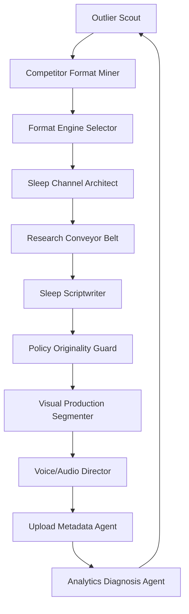

# YT Faceless + Sleep Channel Agent Skill Pack

Version: 1.0  
Built: 2026-07-07  
Primary focus: faceless YouTube, sleep channels, content packaging, copy/scriptwriting, and agentic production systems.  
Primary creator source: Saim / `@saimagnate`, with supporting synthesis from Wanner CashCow, WizofYT public snippets, and YouTube's official monetization policy.

## What this pack is

This is an operational skill pack for agents that build, test, script, produce, and improve faceless YouTube channels, especially sleep/history/story channels. It translates public creator insights into safe, reusable workflows.

The pack is designed to be dropped into a multi-agent system or used manually by a YouTube operator. It emphasizes:

- Saim-style outlier mining and format extraction.
- Sleep-channel architecture that avoids generic AI-template risk.
- Scriptwriting and hook-writing workflows.
- Packaging analysis for titles, thumbnails, and first 30 seconds.
- Policy and originality review before production/upload.
- Analytics loops after upload.
- Clear YAML schemas and reusable prompts.

## What this pack is not

- It is not a promise of RPM, revenue, monetization approval, or growth.
- It is not a license to copy creators' scripts, thumbnails, voices, or proprietary assets.
- It is not a replacement for YouTube policy review, copyright clearance, or editorial judgment.

## Quickstart

1. Read `SOURCE_NOTES_AND_SAIM_NUGGETS.md`.
2. Use `ops/AGENT_TEAM_ORCHESTRATION.md` to assign agents.
3. Start with `skills/01_yt_outlier_scout.md` and fill `schemas/outlier_board_template.csv`.
4. Convert promising outliers using `skills/02_competitor_format_miner.md` and `skills/04_format_engine_selector.md`.
5. Build a channel using `skills/19_sleep_channel_architect.md`.
6. Generate research, script, visuals, and metadata using skills 09–21.
7. Run every video through `skills/20_policy_originality_guard.md` before production and before upload.
8. Use `skills/22_analytics_diagnosis_agent.md` at 48 hours, 7 days, and 28 days.

## Suggested first workflow for a sleep channel

## File map

- `SOURCE_NOTES_AND_SAIM_NUGGETS.md` — condensed source-backed nuggets.
- `ops/AGENT_TEAM_ORCHESTRATION.md` — recommended multi-agent team.
- `ops/90_DAY_OPERATING_PLAN.md` — launch/test plan.
- `skills/` — individual agent skills.
- `schemas/` — reusable YAML/CSV templates.
- `prompts/prompt_bank.md` — large prompt bank for agents.
- `examples/` — example sleep-channel strategy, briefs, and reviews.

## Hard safety rule

Extract patterns, never copy assets. The correct object to copy is the operating structure: viewer behavior, emotional packaging, hook logic, title structure, pacing, and retention devices. The script, visuals, voice, title, and thumbnail must be materially original.
